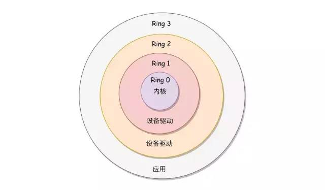
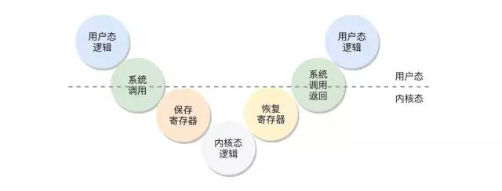
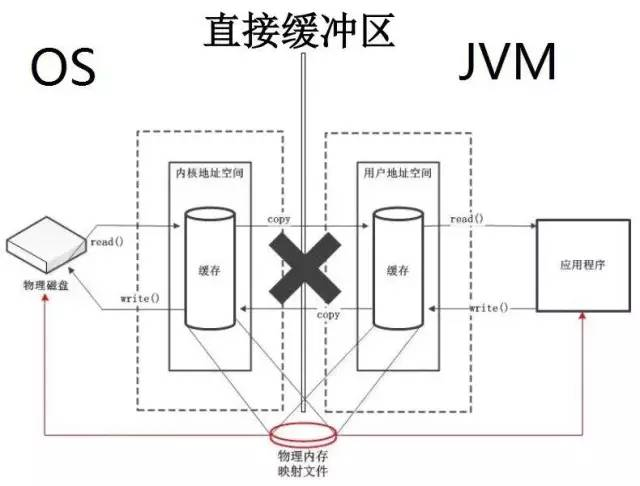
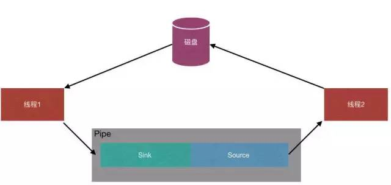

有一个需求需要将前端传过来的10张照片，然后后端进行处理以后压缩成一个压缩包通过网络流传输出去。之前没有接触过用Java压缩文件的，所以就直接上网找了一个例子改了一下用了，改完以后也能使用，但是随着前端所传图片的大小越来越大的时候，耗费的时间也在急剧增加，最后测了一下压缩20M的文件竟然需要30秒的时间。压缩文件的代码如下。

    * 
    * 
    * 
    * 
    * 
    * 
    * 
    * 
    * 
    * 
    * 
    * 
    * 
    * 
    * 

    ```
    public static void zipFileNoBuffer() {File zipFile = new File(ZIP\_FILE);try (ZipOutputStream zipOut = new ZipOutputStream(new FileOutputStream(zipFile))) {//开始时间long beginTime = System.currentTimeMillis();
    for (int i = 0; i \< 10; i++) {try (InputStream input = new FileInputStream(JPG\_FILE)) { zipOut.putNextEntry(new ZipEntry(FILE\_NAME + i));int temp = 0;while ((temp = input.read()) != -1) { zipOut.write(temp);}}} printInfo(beginTime);} catch (Exception e) { e.printStackTrace();}}
    ```

这里找了一张2M大小的图片，并且循环十次进行测试。打印的结果如下，时间大概是30秒。

    * 
    * 

    ```
    fileSize:20Mconsum time:29599
    ```

**第一次优化过程-从30秒到2秒**
-------------------

进行优化首先想到的是利用**缓冲区** BufferInputStream。在 FileInputStream中 read()方法每次只读取一个字节。源码中也有说明。

    * 
    * 
    * 
    * 
    * 
    * 
    * 
    * 
    * 

    ```
    /\*\*\* Reads a byte of data from this input stream. This method blocks \* if no input is yet available. \* \* @return the next byte of data, or \<code\>-1\</code\> if the end of the \* file is reached. \* @exception IOException if an I/O error occurs. \*/public native int read() throws IOException;
    ```

这是一个调用本地方法与原生操作系统进行交互，从磁盘中读取数据。每读取一个字节的数据就调用一次本地方法与操作系统交互，是非常耗时的。例如我们现在有30000个字节的数据，如果使用 FileInputStream那么就需要调用30000次的本地方法来获取这些数据，而如果使用缓冲区的话（这里假设初始的缓冲区大小足够放下30000字节的数据）那么只需要调用一次就行。因为缓冲区在第一次调用 read()方法的时候会直接从磁盘中将数据直接读取到内存中。随后再一个字节一个字节的慢慢返回。

> BufferedInputStream内部封装了一个byte数组用于存放数据，默认大小是8192

优化过后的代码如下

    * 
    * 
    * 
    * 
    * 
    * 
    * 
    * 
    * 
    * 
    * 
    * 
    * 
    * 

    ```
    public static void zipFileBuffer() {File zipFile = new File(ZIP\_FILE);try (ZipOutputStream zipOut = new ZipOutputStream(new FileOutputStream(zipFile));BufferedOutputStream bufferedOutputStream = new BufferedOutputStream(zipOut)) {//开始时间long beginTime = System.currentTimeMillis();for (int i = 0; i \< 10; i++) {try (BufferedInputStream bufferedInputStream = new BufferedInputStream(new FileInputStream(JPG\_FILE))) { zipOut.putNextEntry(new ZipEntry(FILE\_NAME + i));int temp = 0;while ((temp = bufferedInputStream.read()) != -1) { bufferedOutputStream.write(temp);}}} printInfo(beginTime);} catch (Exception e) { e.printStackTrace();}}
    ```

输出

    * 
    * 
    * 

    ```
    ------BufferfileSize:20Mconsum time:1808
    ```

可以看到相比较于第一次使用 FileInputStream效率已经提升了许多了

**第二次优化过程-从2秒到1秒**
------------------

使用缓冲区 buffer的话已经是满足了我的需求了，但是秉着学以致用的想法，就想着用NIO中知识进行优化一下。

### **使用Channel**

为什么要用 Channel呢？因为在NIO中新出了 Channel和 ByteBuffer。正是因为它们的结构更加符合操作系统执行I/O的方式，所以其速度相比较于传统IO而言速度有了显著的提高。Channel就像一个包含着煤矿的矿藏，而 ByteBuffer则是派送到矿藏的卡车。也就是说我们与数据的交互都是与 ByteBuffer的交互。

在NIO中能够产生 FileChannel的有三个类。分别是 FileInputStream、 FileOutputStream、以及既能读又能写的 RandomAccessFile。

源码如下

    * 
    * 
    * 
    * 
    * 
    * 
    * 
    * 
    * 
    * 
    * 
    * 

    ```
    public static void zipFileChannel() {//开始时间long beginTime = System.currentTimeMillis();File zipFile = new File(ZIP\_FILE);try (ZipOutputStream zipOut = new ZipOutputStream(new FileOutputStream(zipFile));WritableByteChannel writableByteChannel = Channels.newChannel(zipOut)) {for (int i = 0; i \< 10; i++) {try (FileChannel fileChannel = new FileInputStream(JPG\_FILE).getChannel()) { zipOut.putNextEntry(new ZipEntry(i + SUFFIX\_FILE)); fileChannel.transferTo(0, FILE\_SIZE, writableByteChannel);}} printInfo(beginTime);} catch (Exception e) { e.printStackTrace();}}
    ```

我们可以看到这里并没有使用 ByteBuffer进行数据传输，而是使用了 transferTo的方法。这个方法是将两个通道进行直连。

    * 
    * 
    * 
    * 

    ```
    This method is potentially much more efficient than a simple loop\* that reads from this channel and writes to the target channel. Many\* operating systems can transfer bytes directly from the filesystem cache\* to the target channel without actually copying them.
    ```

这是源码上的描述文字，大概意思就是使用 transferTo的效率比循环一个 Channel读取出来然后再循环写入另一个 Channel好。操作系统能够直接传输字节从文件系统缓存到目标的 Channel中，而不需要实际的 copy阶段。

> copy阶段就是从内核空间转到用户空间的一个过程

可以看到速度相比较使用缓冲区已经有了一些的提高。

    * 
    * 
    * 

    ```
    ------ChannelfileSize:20Mconsum time:1416
    ```

### **内核空间和用户空间**

那么为什么从内核空间转向用户空间这段过程会慢呢？首先我们需了解的是什么是内核空间和用户空间。在常用的操作系统中为了保护系统中的核心资源，于是将系统设计为四个区域，越往里权限越大，所以Ring0被称之为内核空间，用来访问一些关键性的资源。Ring3被称之为用户空间。



image

> 用户态、内核态：线程处于内核空间称之为内核态，线程处于用户空间属于用户态

那么我们如果此时应用程序（应用程序是都属于用户态的）需要访问核心资源怎么办呢？那就需要调用内核中所暴露出的接口用以调用，称之为**系统调用**。例如此时我们应用程序需要访问磁盘上的文件。此时应用程序就会调用系统调用的接口 open方法，然后内核去访问磁盘中的文件，将文件内容返回给应用程序。大致的流程如下



image

### **直接缓冲区和非直接缓冲区**

既然我们要读取一个磁盘的文件，要废这么大的周折。有没有什么简单的方法能够使我们的应用直接操作磁盘文件，不需要内核进行中转呢？有，那就是建立直接缓冲区了。

**非直接缓冲区：**非直接缓冲区就是我们上面所讲内核态作为中间人，每次都需要内核在中间作为中转。

    * 
    * 

    ```
    image
    ```

**直接缓冲区：**直接缓冲区不需要内核空间作为中转copy数据，而是直接在物理内存申请一块空间，这块空间映射到内核地址空间和用户地址空间，应用程序与磁盘之间数据的存取通过这块直接申请的物理内存进行交互。



image

既然直接缓冲区那么快，我们为什么不都用直接缓冲区呢？其实直接缓冲区有以下的缺点。直接缓冲区的缺点：

1、不安全

2、消耗更多，因为它不是在JVM中直接开辟空间。这部分内存的回收只能依赖于垃圾回收机制，垃圾什么时候回收不受我们控制。

3、数据写入物理内存缓冲区中，程序就丧失了对这些数据的管理，即什么时候这些数据被最终写入从磁盘只能由操作系统来决定，应用程序无法再干涉。

> 综上所述，所以我们使用 transferTo方法就是直接开辟了一段直接缓冲区。所以性能相比而言提高了许多

### **使用内存映射文件**

NIO中新出的另一个特性就是内存映射文件，内存映射文件为什么速度快呢？其实原因和上面所讲的一样，也是在内存中开辟了一段直接缓冲区。与数据直接作交互。源码如下

    * 
    * 
    * 
    * 
    * 
    * 
    * 
    * 
    * 
    * 
    * 
    * 
    * 
    * 

    ```
    //Version 4 使用Map映射文件public static void zipFileMap() {//开始时间long beginTime = System.currentTimeMillis();File zipFile = new File(ZIP\_FILE);try (ZipOutputStream zipOut = new ZipOutputStream(new FileOutputStream(zipFile));WritableByteChannel writableByteChannel = Channels.newChannel(zipOut)) {for (int i = 0; i \< 10; i++) { zipOut.putNextEntry(new ZipEntry(i + SUFFIX\_FILE));//内存中的映射文件MappedByteBuffer mappedByteBuffer = new RandomAccessFile(JPG\_FILE\_PATH, "r").getChannel().map(FileChannel.MapMode.READ\_ONLY, 0, FILE\_SIZE); writableByteChannel.write(mappedByteBuffer);}  printInfo(beginTime);} catch (Exception e) {  e.printStackTrace();}}
    ```

打印如下

    * 
    * 
    * 

    ```
    ---------MapfileSize:20Mconsum time:1305
    ```

可以看到速度和使用Channel的速度差不多的。

### **使用Pipe**

Java NIO 管道是2个线程之间的单向数据连接。Pipe有一个source通道和一个sink通道。其中source通道用于读取数据，sink通道用于写入数据。可以看到源码中的介绍，大概意思就是写入线程会阻塞至有读线程从通道中读取数据。如果没有数据可读，读线程也会阻塞至写线程写入数据。直至通道关闭。

    * 

    ```
    Whether or not a thread writing bytes to a pipe will block until another thread reads those bytes
    ```



image

我想要的效果是这样的。源码如下

    * 
    * 
    * 
    * 
    * 
    * 
    * 
    * 
    * 
    * 
    * 
    * 
    * 
    * 
    * 
    * 
    * 
    * 
    * 
    * 
    * 
    * 
    * 
    * 
    * 
    * 
    * 
    * 
    * 
    * 
    * 

    ```
    //Version 5 使用Pippublic static void zipFilePip() {long beginTime = System.currentTimeMillis();try(WritableByteChannel out = Channels.newChannel(new FileOutputStream(ZIP\_FILE))) {Pipe pipe = Pipe.open();//异步任务CompletableFuture.runAsync(()-\>runTask(pipe));
    //获取读通道ReadableByteChannel readableByteChannel = pipe.source();ByteBuffer buffer = ByteBuffer.allocate(((int) FILE\_SIZE)\*10);while (readableByteChannel.read(buffer)\>= 0) { buffer.flip();out.write(buffer); buffer.clear();}}catch (Exception e){ e.printStackTrace();} printInfo(beginTime);}//异步任务public static void runTask(Pipe pipe) {try(ZipOutputStream zos = new ZipOutputStream(Channels.newOutputStream(pipe.sink()));WritableByteChannel out = Channels.newChannel(zos)) {System.out.println("Begin");for (int i = 0; i \< 10; i++) { zos.putNextEntry(new ZipEntry(i+SUFFIX\_FILE));FileChannel jpgChannel = new FileInputStream(new File(JPG\_FILE\_PATH)).getChannel(); jpgChannel.transferTo(0, FILE\_SIZE, out); jpgChannel.close();}} catch (Exception e){  e.printStackTrace();}}
    ```

**总结**
------

生活处处都需要学习，有时候只是一个简单的优化，可以让你深入学习到各种不同的知识。所以在学习中要不求甚解，不仅要知道这个知识也要了解为什么要这么做。

知行合一：学习完一个知识要尽量应用一遍。这样才能记得牢靠

参考文章
----

https://www.jianshu.com/p/f90866dcbffc https://juejin.im/post/5af942c6f265da0b7026050c
来源：https://www.jianshu.com/p/25b328753017