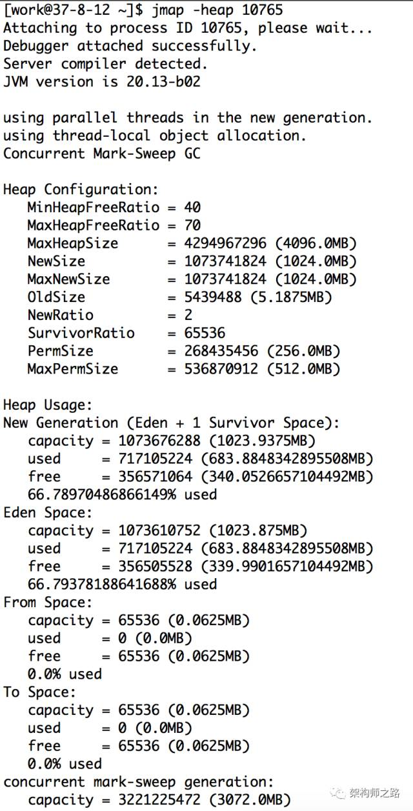
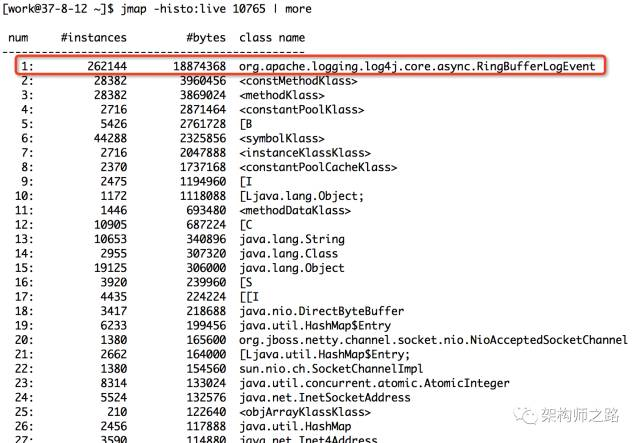

最近有朋友在知识星球提问：
沈老师，有一个Java服务出现了OOM(Out Of Memory)问题，定位了好久不得其法，请问有什么好的思路么？
OOM的问题，印象中之前写过，这里再总结一些相对通用的方案，希望能帮助到Java技术栈的同学。

某Java服务（假设PID=10765）出现了OOM，最常见的原因为：

* 有可能是内存分配确实过小，而正常业务使用了大量内存
* 某一个对象被频繁申请，却没有释放，内存不断泄漏，导致内存耗尽
* 某一个资源被频繁申请，系统资源耗尽，例如：不断创建线程，不断发起网络连接

画外音：无非“本身资源不够”“申请资源太多”“资源耗尽”几个原因。

更具体的，可以使用以下工具逐一排查。

**一、确认是不是内存本身就分配过小**

方法：jmap -heap 10765

如上图，可以查看新生代，老生代堆内存的分配大小以及使用情况，看是否本身分配过小。

**二、找到最耗内存的对象**

方法：jmap -histo:live 10765 | more

如上图，输入命令后，会以表格的形式显示存活对象的信息，并按照所占内存大小排序：

* **实例数**
* **所占内存大小**
* **类名**

是不是很直观？对于实例数较多，占用内存大小较多的实例/类，相关的代码就要针对性review了。

上图中占内存最多的对象是RingBufferLogEvent，共占用内存18M，属于正常使用范围。

如果发现某类对象占用内存很大（例如几个G），很可能是类对象创建太多，且一直未释放。例如：

* 申请完资源后，未调用close()或dispose()释放资源
* 消费者消费速度慢（或停止消费了），而生产者不断往队列中投递任务，导致队列中任务累积过多

画外音：线上执行该命令会强制执行一次fgc。另外还可以dump内存进行分析。

**三、确认是否是资源耗尽**

工具：

* pstree
* netstat

查看进程创建的线程数，以及网络连接数，如果资源耗尽，也可能出现OOM。

这里介绍另一种方法，通过

* /proc/${PID}/fd
* /proc/${PID}/task

可以分别查看句柄详情和线程数。

例如，某一台线上服务器的sshd进程PID是9339，查看

* ll /proc/9339/fd
* ll /proc/9339/task

如上图，sshd共占用了四个句柄

* 0 -\> 标准输入
* 1 -\> 标准输出
* 2 -\> 标准错误输出
* 3 -\> socket（容易想到是监听端口）

sshd只有一个主线程PID为9339，并没有多线程。

所以，只要

* ll /proc/${PID}/fd | wc -l
* ll /proc/${PID}/task | wc -l （效果等同pstree -p | wc -l）

就能知道进程打开的句柄数和线程数。

希望这1分钟能帮到这位星球水友。

你遇到过奇葩的OOM问题么？是怎么定位的？欢迎分享。