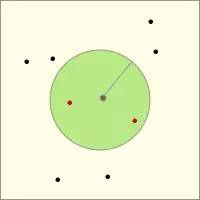
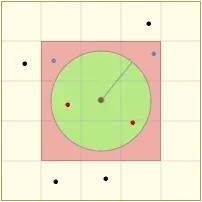

**前言**：针对“附近的人”这一位置服务领域的应用场景，常见的可使用PG、MySQL和MongoDB等多种DB的空间索引进行实现。而Redis另辟蹊径，结合其有序队列zset以及geohash编码，实现了空间搜索功能，且拥有极高的运行效率。

本文将从源码角度对其算法原理进行解析，并推算查询时间复杂度。

要提供完整的“附近的人”服务，最基本的是要实现“增”、“删”、“查”的功能。以下将分别进行介绍，其中会重点对查询功能进行解析。

**
**

**操作命令******
------------

自Redis 3.2开始，Redis基于geohash和有序集合提供了地理位置相关功能。Redis Geo模块包含了以下6个命令：

* **GEOADD**: 将给定的位置对象（纬度、经度、名字）添加到指定的key;

* GEOPOS: 从key里面返回所有给定位置对象的位置（经度和纬度）;

* GEODIST: 返回两个给定位置之间的距离;

* GEOHASH: 返回一个或多个位置对象的Geohash表示;

* **GEORADIUS**: 以给定的经纬度为中心，返回目标集合中与中心的距离不超过给定最大距离的所有位置对象;
* GEORADIUSBYMEMBER: 以给定的位置对象为中心，返回与其距离不超过给定最大距离的所有位置对象。

其中，组合使用GEOADD和GEORADIUS可实现“附近的人”中“增”和“查”的基本功能。

要实现微信中“附近的人”功能，可直接使用GEORADIUSBYMEMBER命令。其中“给定的位置对象”即为用户本人，搜索的对象为其他用户。

不过本质上，GEORADIUSBYMEMBER = GEOPOS + GEORADIUS，即先查找用户位置再通过该位置搜索附近满足位置相互距离条件的其他用户对象。

以下会从源码角度入手对GEOADD和GEORADIUS命令进行分析，剖析其算法原理。

> Redis geo操作中只包含了“增”和“查”的操作，并没有专门的“删除”命令。主要是因为Redis内部使用有序集合(zset)保存位置对象，可用zrem进行删除。

> 在Redis源码geo.c的文件注释中，只说明了该文件为GEOADD、GEORADIUS和GEORADIUSBYMEMBER的实现文件（其实在也实现了另三个命令）。从侧面看出其他三个命令为辅助命令。

**
**
-----

**GEOADD**
----------

### **
**

### **使用方式**

**
**

```

```
GEOADD key longitude latitude member [longitude latitude member ...]
```

```

将给定的位置对象（纬度、经度、名字）添加到指定的key。

其中，key为集合名称，member为该经纬度所对应的对象。在实际运用中，当所需存储的对象数量过多时，可通过设置多key(如一个省一个key)的方式对对象集合变相做sharding，避免单集合数量过多。

成功插入后的返回值：

    (integer) N

其中N为成功插入的个数。

### **源码分析**

```
/\* GEOADD key long lat name [long2 lat2 name2 ... longN latN nameN] \*/
void geoaddCommand(client \*c) {

//参数校验
    /\* Check arguments number for sanity. \*/
    if ((c->argc - 2) % 3 != 0) {
        /\* Need an odd number of arguments if we got this far... \*/
        addReplyError(c, "syntax error. Try GEOADD key [x1] [y1] [name1] "
                         "[x2] [y2] [name2] ... ");
          return;
    }

//参数提取Redis
    int elements = (c->argc - 2) / 3;
    int argc = 2+elements*2; /\* ZADD key score ele ... \*/
    robj **argv = zcalloc(argc*sizeof(robj*));
    argv[0] = createRawStringObject("zadd",4);
    argv[1] = c->argv[1]; /\* key \*/
    incrRefCount(argv[1]);

//参数遍历+转换
    /\* Create the argument vector to call ZADD in order to add all
 \* the score,value pairs to the requested zset, where score is actually
 \* an encoded version of lat,long. \*/
    int i;
    for (i = 0; i < elements; i++) {
        double xy[2];

    //提取经纬度
        if (extractLongLatOrReply(c, (c->argv+2)+(i*3),xy) == C_ERR) {
            for (i = 0; i < argc; i++)
                if (argv[i]) decrRefCount(argv[i]);
            zfree(argv);
            return;
        }

    //将经纬度转换为52位的geohash作为分值 & 提取对象名称
        /\* Turn the coordinates into the score of the element. \*/
        GeoHashBits hash;
        geohashEncodeWGS84(xy[0], xy[1], GEO_STEP_MAX, &hash);
        GeoHashFix52Bits bits = geohashAlign52Bits(hash);
        robj *score = createObject(OBJ_STRING, sdsfromlonglong(bits));
        robj *val = c->argv[2 + i * 3 + 2];

    //设置有序集合的对象元素名称和分值
        argv[2+i*2] = score;
        argv[3+i*2] = val;
        incrRefCount(val);
    }

//调用zadd命令，存储转化好的对象
    /\* Finally call ZADD that will do the work for us. \*/
    replaceClientCommandVector(c,argc,argv);
    zaddCommand(c);
}
```

```

```

通过源码分析可以看出Redis内部使用有序集合(zset)保存位置对象，有序集合中每个元素都是一个带位置的对象，元素的score值为其经纬度对应的52位的geohash值。

> double类型精度为52位；
> geohash是以base32的方式编码，52bits最高可存储10位geohash值，对应地理区域大小为0.6\*0.6米的格子。换句话说经Redis geo转换过的位置理论上会有约0.3\*1.414=0.424米的误差。

### 

### **算法小结**

简单总结下GEOADD命令都干了啥：
1、参数提取和校验；
2、将入参经纬度转换为52位的geohash值（score）；
3、调用ZADD命令将member及其对应的score存入集合key中。

-

**GEORADIUS**
-------------

### **使用方式**

**
**

```
GEORADIUS key longitude latitude radius m|km|ft|mi [WITHCOORD] [WITHDIST] [WITHHASH] [ASC|DESC] [COUNT count] [STORE key] [STORedisT key]
```

    以给定的经纬度为中心，返回目标集合中与中心的距离不超过给定最大距离的所有位置对象。

范围单位：m | km | ft | mi --\> 米 | 千米 | 英尺 | 英里

**
**

**额外参数：**

- WITHDIST：在返回位置对象的同时，将位置对象与中心之间的距离也一并返回。距离的单位和用户给定的范围单位保持一致。

- WITHCOORD：将位置对象的经度和维度也一并返回。

- WITHHASH：以 52 位有符号整数的形式，返回位置对象经过原始 geohash 编码的有序集合分值。这个选项主要用于底层应用或者调试，实际中的作用并不大。

- ASC|DESC：从近到远返回位置对象元素 | 从远到近返回位置对象元素。- COUNT count：选取前N个匹配位置对象元素。（不设置则返回所有元素） - STORE key：将返回结果的地理位置信息保存到指定key。- STORedisT key：将返回结果离中心点的距离保存到指定key。

> 由于 STORE 和 STORedisT 两个选项的存在，GEORADIUS 和 GEORADIUSBYMEMBER 命令在技术上会被标记为写入命令，从而只会查询（写入）主实例，QPS过高时容易造成主实例读写压力过大。
> 
> 为解决这个问题，在 Redis 3.2.10 和 Redis 4.0.0 中，分别新增了 GEORADIUS\_RO 和 GEORADIUSBYMEMBER\_RO两个只读命令。
> 
> 不过，在实际开发中笔者发现 在java package `Redis.clients.jedis.params.geo` 的 GeoRadiusParam 参数类中并不包含 STORE 和 STORedisT 两个参数选项，在调用georadius时是否真的只查询了主实例，还是进行了只读封装。感兴趣的朋友可以自己研究下。

成功查询后的返回值：

不带WITH限定，返回一个member list，如：

    ["member1","member2","member3"]

带WITH限定，member list中每个member也是一个嵌套list，如：

```
[
  ["member1", distance1, [longitude1, latitude1]]
  ["member2", distance2, [longitude2, latitude2]]
]
```

    **
    **

### **源码分析**

> 此段源码较长，看不下去的可直接看中文注释，或直接跳到小结部分

```
/\* GEORADIUS key x y radius unit [WITHDIST] [WITHHASH] [WITHCOORD] [ASC|DESC]
 \* [COUNT count] [STORE key] [STORedisT key]
 \* GEORADIUSBYMEMBER key member radius unit ... options ... \*/
void georadiusGeneric(client \*c, int flags) {
    robj *key = c->argv[1];
    robj *storekey = NULL;
    int stoRedist = 0; /\* 0 for STORE, 1 for STORedisT. \*/

//根据key获取有序集合
    robj *zobj = NULL;
    if ((zobj = lookupKeyReadOrReply(c, key, shared.null[c->resp])) == NULL ||
        checkType(c, zobj, OBJ_ZSET)) {
        return;
    }

//根据用户输入（经纬度/member）确认中心点经纬度
    int base_args;
    double xy[2] = { 0 };
    if (flags & RADIUS_COORDS) {
    ……
    }

//获取查询范围距离
    double radius_meters = 0, conversion = 1;
    if ((radius_meters = extractDistanceOrReply(c, c->argv + base_args - 2,
                                                &conversion)) < 0) {
        return;
    }

//获取可选参数 （withdist、withhash、withcoords、sort、count）
    int withdist = 0, withhash = 0, withcoords = 0;
    int sort = SORT_NONE;
    long long count = 0;
    if (c->argc > base_args) {
        ... ...
    }

//获取 STORE 和 STORedisT 参数
    if (storekey && (withdist || withhash || withcoords)) {
        addReplyError(c,
            "STORE option in GEORADIUS is not compatible with "
            "WITHDIST, WITHHASH and WITHCOORDS options");
        return;
    }

//设定排序
    if (count != 0 && sort == SORT_NONE) sort = SORT_ASC;

//利用中心点和半径计算目标区域范围
    GeoHashRadius georadius =
        geohashGetAreasByRadiusWGS84(xy[0], xy[1], radius_meters);

//对中心点及其周围8个geohash网格区域进行查找，找出范围内元素对象
    geoArray *ga = geoArrayCreate();
    membersOfAllNeighbors(zobj, georadius, xy[0], xy[1], radius_meters, ga);

//未匹配返空
    /\* If no matching results, the user gets an empty reply. \*/
    if (ga->used == 0 && storekey == NULL) {
        addReplyNull(c);
        geoArrayFree(ga);
        return;
    }

//一些返回值的设定和返回
    ……
    geoArrayFree(ga);
}
```

```

```

上文代码中最核心的步骤有两个，一是“计算中心点范围”，二是“对中心点及其周围8个geohash网格区域进行查找”。

对应的是`geohashGetAreasByRadiusWGS84`和`membersOfAllNeighbors`两个函数。

我们依次来看：

* 计算中心点范围：

**// geohash\_helper.c**

```
GeoHashRadius geohashGetAreasByRadiusWGS84(double longitude, double latitude,
 double radius\_meters) {
    return geohashGetAreasByRadius(longitude, latitude, radius_meters);
}

//返回能够覆盖目标区域范围的9个geohashBox
GeoHashRadius geohashGetAreasByRadius(double longitude, double latitude, double radius\_meters) {
//一些参数设置
    GeoHashRange long_range, lat_range;
    GeoHashRadius radius;
    GeoHashBits hash;
    GeoHashNeighbors neighbors;
    GeoHashArea area;
    double min_lon, max_lon, min_lat, max_lat;
    double bounds[4];
    int steps;

//计算目标区域外接矩形的经纬度范围（目标区域为：以目标经纬度为中心，半径为指定距离的圆）
    geohashBoundingBox(longitude, latitude, radius_meters, bounds);
    min_lon = bounds[0];
    min_lat = bounds[1];
    max_lon = bounds[2];
    max_lat = bounds[3];

//根据目标区域中心点纬度和半径，计算带查询的9个搜索框的geohash精度（位）
//这里用到latitude主要是针对极地的情况对精度进行了一些调整（纬度越高，位数越小）
    steps = geohashEstimateStepsByRadius(radius_meters,latitude);

//设置经纬度最大最小值：-180\<=longitude\<=180, -85\<=latitude\<=85
    geohashGetCoordRange(&long_range,&lat_range);

//将待查经纬度按指定精度（steps）编码成geohash值
    geohashEncode(&long_range,&lat_range,longitude,latitude,steps,&hash);

//将geohash值在8个方向上进行扩充，确定周围8个Box（neighbors）
    geohashNeighbors(&hash,&neighbors);

//根据hash值确定area经纬度范围
    geohashDecode(long_range,lat_range,hash,&area);

//一些特殊情况处理
    ……

//构建并返回结果
    radius.hash = hash;
    radius.neighbors = neighbors;
    radius.area = area;
    return radius;
}
```

```

```

* 对中心点及其周围8个geohash网格区域进行查找:

**// geo.c**

**
**

```
//在9个hashBox中获取想要的元素
int membersOfAllNeighbors(robj \*zobj, GeoHashRadius n, double lon, double lat, double radius, geoArray \*ga) {
    GeoHashBits neighbors[9];
    unsigned int i, count = 0, last_processed = 0;
    int debugmsg = 0;

//获取9个搜索hashBox
    neighbors[0] = n.hash;
    ……
    neighbors[8] = n.neighbors.south_west;

//在每个hashBox中搜索目标点
    for (i = 0; i < sizeof(neighbors) / sizeof(*neighbors); i++) {
        if (HASHISZERO(neighbors[i])) {
            if (debugmsg) D("neighbors[%d] is zero",i);
            continue;
        }

  //剔除可能的重复hashBox (搜索半径\>5000KM时可能出现)
        if (last_processed &&
            neighbors[i].bits == neighbors[last_processed].bits &&
            neighbors[i].step == neighbors[last_processed].step)
        {
            continue;
        }

  //搜索hashBox中满足条件的对象
        count += membersOfGeoHashBox(zobj, neighbors[i], ga, lon, lat, radius);
        last_processed = i;
    }
    return count;
}

int membersOfGeoHashBox(robj \*zobj, GeoHashBits hash, geoArray \*ga, double lon, double lat, double radius) {
//获取hashBox内的最大、最小geohash值（52位）
    GeoHashFix52Bits min, max;
    scoresOfGeoHashBox(hash,&min,&max);

//根据最大、最小geohash值筛选zobj集合中满足条件的点
    return geoGetPointsInRange(zobj, min, max, lon, lat, radius, ga);
}

int geoGetPointsInRange(robj \*zobj, double min, double max, double lon, double lat, double radius, geoArray \*ga) {

//搜索Range的参数边界设置（即9个hashBox其中一个的边界范围）
    zrangespec range = { .min = min, .max = max, .minex = 0, .maxex = 1 };
    size\_t origincount = ga->used;
    sds member;

//搜索集合zobj可能有ZIPLIST和SKIPLIST两种编码方式，这里以SKIPLIST为例，逻辑是一样的
    if (zobj->encoding == OBJ_ENCODING_ZIPLIST) {
        ……
    } else if (zobj->encoding == OBJ_ENCODING_SKIPLIST) {
        zset *zs = zobj->ptr;
        zskiplist *zsl = zs->zsl;
        zskiplistNode *ln;

  //获取在hashBox范围内的首个元素（跳表数据结构，效率可比拟于二叉查找树），没有则返0
        if ((ln = zslFirstInRange(zsl, &range)) == NULL) {
            /\* Nothing exists starting at our min. No results. \*/
            return 0;
        }

  //从首个元素开始遍历集合
        while (ln) {
            sds ele = ln->ele;
    //遍历元素超出range范围则break
            /\* Abort when the node is no longer in range. \*/
            if (!zslValueLteMax(ln->score, &range))
                break;
    //元素校验（计算元素与中心点的距离）
            ele = sdsdup(ele);
            if (geoAppendIfWithinRadius(ga,lon,lat,radius,ln->score,ele)
                == C_ERR) sdsfree(ele);
            ln = ln->level[0].forward;
        }
    }
    return ga->used - origincount;
}

int geoAppendIfWithinRadius(geoArray \*ga, double lon, double lat, double radius, double score, sds member) {
    double distance, xy[2];

//解码错误, 返回error
    if (!decodeGeohash(score,xy)) return C_ERR; /\* Can't decode. \*/

//最终距离校验(计算球面距离distance看是否小于radius)
    if (!geohashGetDistanceIfInRadiusWGS84(lon,lat, xy[0], xy[1],
                                           radius, &distance))
    {
        return C_ERR;
    }

//构建并返回满足条件的元素
    geoPoint *gp = geoArrayAppend(ga);
    gp->longitude = xy[0];
    gp->latitude = xy[1];
    gp->dist = distance;
    gp->member = member;
    gp->score = score;
    return C_OK;
}
```

### **算法小结**

抛开众多可选参数不谈，简单总结下GEORADIUS命令是怎么利用geohash获取目标位置对象的：

1、参数提取和校验；

2、利用中心点和输入半径计算待查区域范围。这个范围参数包括满足条件的最高的geohash网格等级(精度) 以及 对应的能够覆盖目标区域的九宫格位置；（后续会有详细说明）

3、对九宫格进行遍历，根据每个geohash网格的范围框选出位置对象。进一步找出与中心点距离小于输入半径的对象，进行返回。

直接描述不太好理解，我们通过如下两张图在对算法进行简单的演示：



令左图的中心为搜索中心，绿色圆形区域为目标区域，所有点为待搜索的位置对象，红色点则为满足条件的位置对象。

在实际搜索时,首先会根据搜索半径计算geohash网格等级（即右图中网格大小等级），并确定九宫格位置（即红色九宫格位置信息）；再依次查找计算九宫格中的点（蓝点和红点）与中心点的距离，最终筛选出距离范围内的点（红点）。

### **算法分析**

为什么要用这种算法策略进行查询，或者说这种策略的优势在哪，让我们以问答的方式进行分析说明。

为什么要找到满足条件的最高的geohash网格等级？为什么用九宫格？

这其实是一个问题，本质上是对所有的元素对象进行了一次初步筛选。 在多层geohash网格中，每个低等级的geohash网格都是由4个高一级的网格拼接而成（如图）。


换句话说，geohash网格等级越高，所覆盖的地理位置范围就越小。当我们根据输入半径和中心点位置计算出的能够覆盖目标区域的最高等级的九宫格（网格）时，就已经对九宫格外的元素进行了筛除。

这里之所以使用九宫格，而不用单个网格，主要原因还是为了避免边界情况，尽可能缩小查询区域范围。试想以0经纬度为中心，就算查1米范围，单个网格覆盖的话也得查整个地球区域。而向四周八个方向扩展一圈可有效避免这个问题。

如何通过geohash网格的范围框选出元素对象？效率如何？

首先在每个geohash网格中的geohash值都是连续的，有固定范围。所以只要找出有序集合中，处在该范围的位置对象即可。以下是有序集合的跳表数据结构：


其拥有类似二叉查找树的查询效率，操作平均时间复杂性为O(log(N))。且最底层的所有元素都以链表的形式按序排列。

所以在查询时，只要找到集合中处在目标geohash网格中的第一个值，后续依次对比即可，不用多次查找。 

九宫格不能一起查，要一个个遍历的原因也在于九宫格各网格对应的geohash值不具有连续性。只有连续了，查询效率才会高，不然要多做许多距离运算。

综上，我们从源码角度解析了Redis Geo模块中 “增（GEOADD）” 和 “查（GEORADIUS）” 的详细过程。并可推算出Redis中GEORADIUS查找附近的人功能，时间复杂度为：O(N+log(M))

其中N为指定半径范围内的位置元素数量，而M则是被九宫格圈住计算距离的元素的数量。结合Redis本身基于内存的存储特性，在实际使用过程中有非常高的运行效率。

**END**

作者简介

万汨，饿了么资深开发工程师。iOS，Go，Java均有涉猎。目前主攻大数据开发。喜欢骑行、爬山。