目录

. 一、基本概念

. 1、背景

. 2、简介

. 3、特点

. 4、基础模型

. 5、Apollo 的四个维度

. 6、本地缓存

. 7、客户端设计

. 8、总体设计

. 9、可用性考虑

. 二、Apollo 配置中心创建项目与配置

. 1、登录 Apollo

. 2、修改与增加部门数据

. 3、创建一个项目

. 4、创建一个配置参数

. 三、创建 Apollo 客户端测试项目

. 1、Mavne 添加 Apollo 依赖

. 2、配置文件添加参数

. 3、创建测试 Controller 类

. 4、创建启动类

. 5、JVM 启动参数添加启动参数

. 四、启动项目进行测试

. 1、测试是否能够获取 Apollo 中设置的值

. 2、测试当 Apollo 中修改参数值后客户端是否能及时刷新

. 3、测试当 Apollo 执行配置回滚操作时客户端是否能及时改变

. 4、测试当不能访问 Apollo 时客户端的变化

. 5、测试当 Apollo 中将参数删除后客户端的变化

. 五、对 Apollo 的 Cluster、Namespace 进行探究

. 1、不同环境下的配置

. 2、不同集群下的配置

. 3、不同命名空间下的配置

. 六、Kubernetes 的 SpringBoot 应用使用 Apollo 配置中心

. 1、构建 Docker 镜像

. 2、Kubernetes 部署示例应用

. 3、测试部署的应用接口

---

**目录**

* 一、Kubernetes 部署配置中心 Apollo
* 二、SpringBoot 集成 Apollo 配置中心

**系统环境**

* SpringBoot 版本：2.1.8.RELEASE
* Apollo 版本：1.4.0

**参考地址**

* Apollo 文档知识
* Apollo Github 地址
* SpringBoto 集成 Apollo 示例项目 Github 地址：https://github.com/my-dlq/blog-example/tree/master/springboot/springboot-apollo-demo

一、基本概念
------

由于 Apollo 概念比较多，刚开始使用比较复杂，最好先过一遍概念再动手实践尝试使用。

### 1、背景

随着程序功能的日益复杂，程序的配置日益增多，各种功能的开关、参数的配置、服务器的地址……对程序配置的期望值也越来越高，配置修改后实时生效，灰度发布，分环境、分集群管理配置，完善的权限、审核机制…… 在这样的大环境下，传统的通过配置文件、数据库等方式已经越来越无法满足开发人员对配置管理的需求。因此 Apollo 配置中心应运而生！

### 2、简介

Apollo（阿波罗）是携程框架部门研发的开源配置管理中心，能够集中化管理应用不同环境、不同集群的配置，配置修改后能够实时推送到应用端，并且具备规范的权限、流程治理等特性。

### 3、特点

* 部署简单
* 灰度发布
* 版本发布管理
* 提供开放平台API
* 客户端配置信息监控
* 提供Java和.Net原生客户端
* 配置修改实时生效（热发布）
* 权限管理、发布审核、操作审计
* 统一管理不同环境、不同集群的配置

### 4、基础模型

如下即是 Apollo 的基础模型：

* (1)、用户在配置中心对配置进行修改并发布
* (2)、配置中心通知Apollo客户端有配置更新
* (3)、Apollo客户端从配置中心拉取最新的配置、更新本地配置并通知到应用

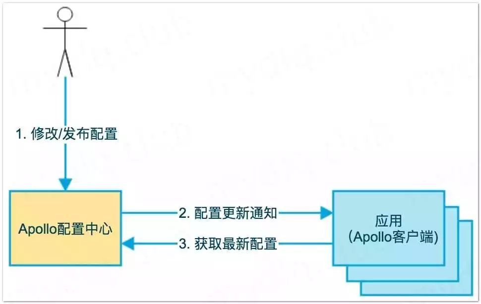

### 5、Apollo 的四个维度

**Apollo支持4个维度管理Key-Value格式的配置：**

* application (应用)
* environment (环境)
* cluster (集群)
* namespace (命名空间)

**(1)、application**

* Apollo 客户端在运行时需要知道当前应用是谁，从而可以根据不同的应用来获取对应应用的配置。
* 每个应用都需要有唯一的身份标识，可以在代码中配置 `app.id` 参数来标识当前应用，Apollo 会根据此指来辨别当前应用。

**(2)、environment**

在实际开发中，我们的应用经常要部署在不同的环境中，一般情况下分为开发、测试、生产等等不同环境，不同环境中的配置也是不同的，在 Apollo 中默认提供了四种环境：

* FAT（Feature Acceptance Test）：功能测试环境
* UAT（User Acceptance Test）：集成测试环境
* DEV（Develop）：开发环境
* PRO（Produce）：生产环境

在程序中如果想指定使用哪个环境，可以配置变量 `env` 的值为对应环境名称即可。

**(3)、cluster**

* 一个应用下不同实例的分组，比如典型的可以按照数据中心分，把上海机房的应用实例分为一个集群，把北京机房的应用实例分为另一个集群。
* 对不同的集群，同一个配置可以有不一样的值，比如说上面所指的两个北京、上海两个机房设置两个集群，两个集群中都有 mysql 配置参数，其中参数中配置的地址是不一样的。

**(4)、namespace**

一个应用中不同配置的分组，可以简单地把 namespace 类比为不同的配置文件，不同类型的配置存放在不同的文件中，如数据库配置文件，RPC 配置文件，应用自身的配置文件等。

熟悉 SpringBoot 的都知道，SpringBoot 项目都有一个默认配置文件 `application.yml`，如果还想用多个配置，可以创建多个配置文件来存放不同的配置信息，通过指定 `spring.profiles.active` 参数指定应用不同的配置文件。这里的 `namespace` 概念与其类似，将不同的配置放到不同的配置 `namespace` 中。

Namespace 分为两种权限，分别为：

* **public（公共的）：** public权限的 Namespace，能被任何应用获取。
* **private（私有的）：** 只能被所属的应用获取到。一个应用尝试获取其它应用 private 的 Namespace，Apollo 会报 “404” 异常。

Namespace 分为三种类型，分别为：

* **私有类型：** 私有类型的 Namespace 具有 private 权限。例如 application Namespace 为私有类型。
* **公共类型：** 公共类型的 Namespace 具有 public 权限。公共类型的N amespace 相当于游离于应用之外的配置，且通过 Namespace 的名称去标识公共 Namespace，所以公共的 Namespace 的名称必须全局唯一。
* **关联类型（继承类型）：** 关联类型又可称为继承类型，关联类型具有 private 权限。关联类型的 Namespace 继承于公共类型的 Namespace，将里面的配置全部继承，并且可以用于覆盖公共 Namespace 的某些配置。

### 6、本地缓存

Apollo客户端会把从服务端获取到的配置在本地文件系统缓存一份，用于在遇到服务不可用，或网络不通的时候，依然能从本地恢复配置，不影响应用正常运行。

本地缓存路径默认位于以下路径，所以请确保/opt/data或C:\\opt\\data\\目录存在，且应用有读写权限。

* **Mac/Linux：** /opt/data/{appId}/config-cache
* **Windows：** C:\\opt\\data{appId}\\config-cache

本地配置文件会以下面的文件名格式放置于本地缓存路径下：

```
1{appId}+{cluster}+{namespace}.properties

```

### 7、客户端设计

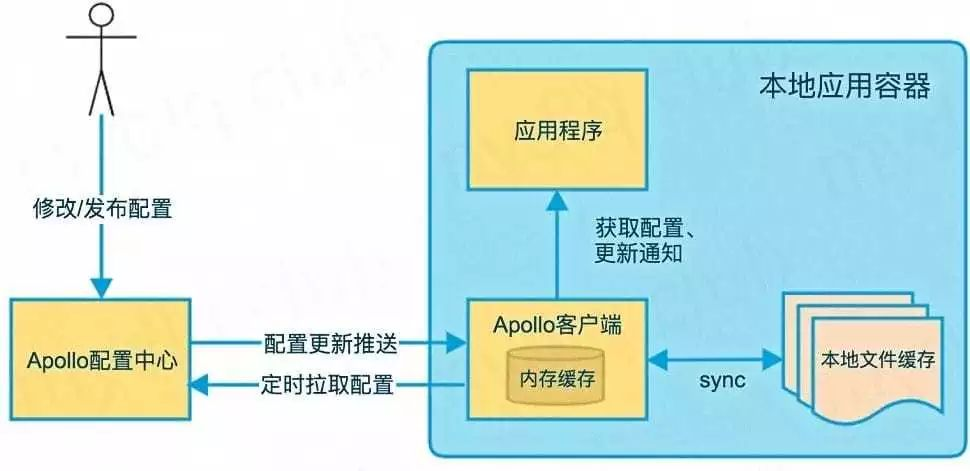

**上图简要描述了Apollo客户端的实现原理**

* 客户端和服务端保持了一个长连接，从而能第一时间获得配置更新的推送。
* 客户端还会定时从 Apollo 配置中心服务端拉取应用的最新配置。
* 这是一个 fallback 机制，为了防止推送机制失效导致配置不更新
* 客户端定时拉取会上报本地版本，所以一般情况下，对于定时拉取的操作，服务端都会返回 304 - Not Modified
* 定时频率默认为每 5 分钟拉取一次，客户端也可以通过在运行时指定 `apollo.refreshInterval` 来覆盖，单位为分钟。
* 客户端从 Apollo 配置中心服务端获取到应用的最新配置后，会保存在内存中。
* 客户端会把从服务端获取到的配置在本地文件系统缓存一份 在遇到服务不可用，或网络不通的时候，依然能从本地恢复配置。
* 应用程序从 Apollo 客户端获取最新的配置、订阅配置更新通知。

**配置更新推送实现**

前面提到了 Apollo 客户端和服务端保持了一个长连接，从而能第一时间获得配置更新的推送。长连接实际上我们是通过 Http Long Polling 实现的，具体而言：

* 客户端发起一个 Http 请求到服务端
* 服务端会保持住这个连接 60 秒
* 如果在 60 秒内有客户端关心的配置变化，被保持住的客户端请求会立即返回，并告知客户端有配置变化的 namespace 信息，客户端会据此拉取对应 namespace 的最新配置
* 如果在 60 秒内没有客户端关心的配置变化，那么会返回 Http 状态码 304 给客户端
* 客户端在收到服务端请求后会立即重新发起连接，回到第一步
* 考虑到会有数万客户端向服务端发起长连，在服务端我们使用了 async servlet(Spring DeferredResult) 来服务 Http Long Polling 请求。

### 8、总体设计

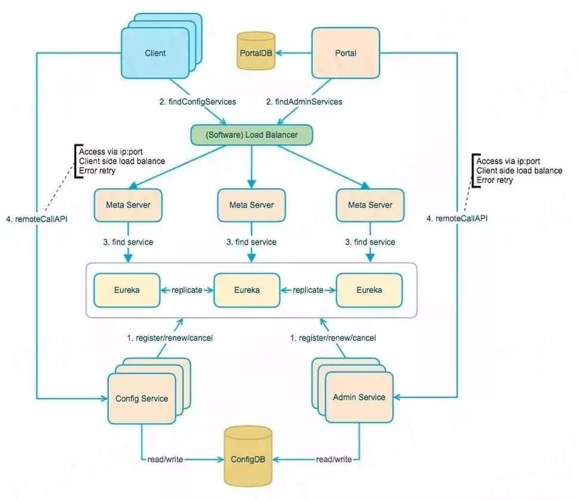

上图简要描述了Apollo的总体设计，我们可以从下往上看：

* Config Service 提供配置的读取、推送等功能，服务对象是 Apollo 客户端
* Admin Service 提供配置的修改、发布等功能，服务对象是 Apollo Portal（管理界面）
* Config Service 和 Admin Service 都是多实例、无状态部署，所以需要将自己注册到 Eureka 中并保持心跳
* 在 Eureka 之上我们架了一层 Meta Server 用于封装Eureka的服务发现接口
* Client 通过域名访问 Meta Server 获取Config Service服务列表（IP+Port），而后直接通过 IP+Port 访问服务，同时在 Client 侧会做 load balance 错误重试
* Portal 通过域名访问 Meta Server 获取 Admin Service 服务列表（IP+Port），而后直接通过 IP+Port 访问服务，同时在 Portal 侧会做 load balance、错误重试
* 为了简化部署，我们实际上会把 Config Service、Eureka 和 Meta Server 三个逻辑角色部署在同一个 JVM 进程中

### 9、可用性考虑

配置中心作为基础服务，可用性要求非常高，下面的表格描述了不同场景下Apollo的可用性：

场景影响降级原因某台 config service 下线无影响
Config service无状态，客户端重连其它config service所有 config service 下线客户端无法读取最新配置，Portal无影响客户端重启时,可以读取本地缓存配置文件
某台 admin service 下线无影响
Admin service无状态，Portal重连其它 admin service所有 admin service 下线客户端无影响，portal无法更新配置

某台 portal 下线无影响
Portal域名通过slb绑定多台服务器，重试后指向可用的服务器全部 portal 下线客户端无影响，portal无法更新配置

某个数据中心下线无影响
多数据中心部署，数据完全同步，Meta Server/Portal 域名通过 slb 自动切换到其它存活的数据中心

二、Apollo 配置中心创建项目与配置
--------------------

接下来我们将创建一个 Apollo 的客户端项目，引用 Apollo 来实现配置动态更新，不过在此之前我们需要提前进入 Apollo Portal 界面，在里面提前创建一个项目并在其配置一个参数，方便后续客户端引入该配置参数，测试是否能动态变化。

### 1、登录 Apollo

我这里是部署到 Kubernetes 中，通过 NodePort 方式暴露出一个端口，打开这个地址登录 Apollo：

* 用户名：apollo
* 密 码：admin

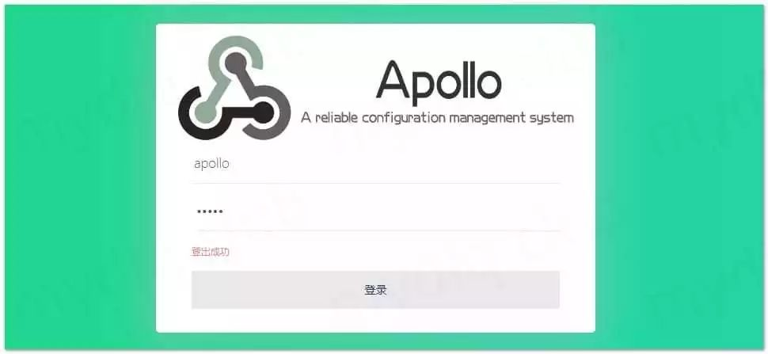

### 2、修改与增加部门数据

在登录后创建项目时，选择部门默认只能选择 Apollo 自带的 测试部门1与测试部门2两个选项。

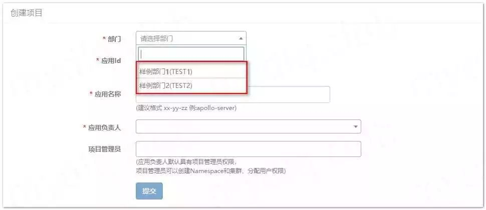

开始这真让人迷糊，原来 Apoloo 没有修改或新增部门信息的管理节目，只能通过修改数据库，来新增或者修改数据，这里打开 `Portal` 对月的数据库中的表 `ApolloPortalDB` 修改 `key` 为 `organizations` 的 `value` 的 json 数据，改成自己对于的部门信息。


### 3、创建一个项目

修改完数据库部门信息后，重新登录 Apollo Portal，然后创建项目，这时候选择部门可以看到已经变成我们自己修改后的部门信息了，选择我们自定义部门，然后设置应用 ID 为 `apollo-test`，应用名为 `apollo-demo` 。

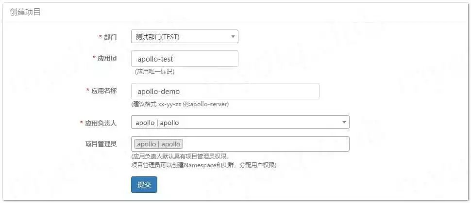

创建完成后进入配置管理界面

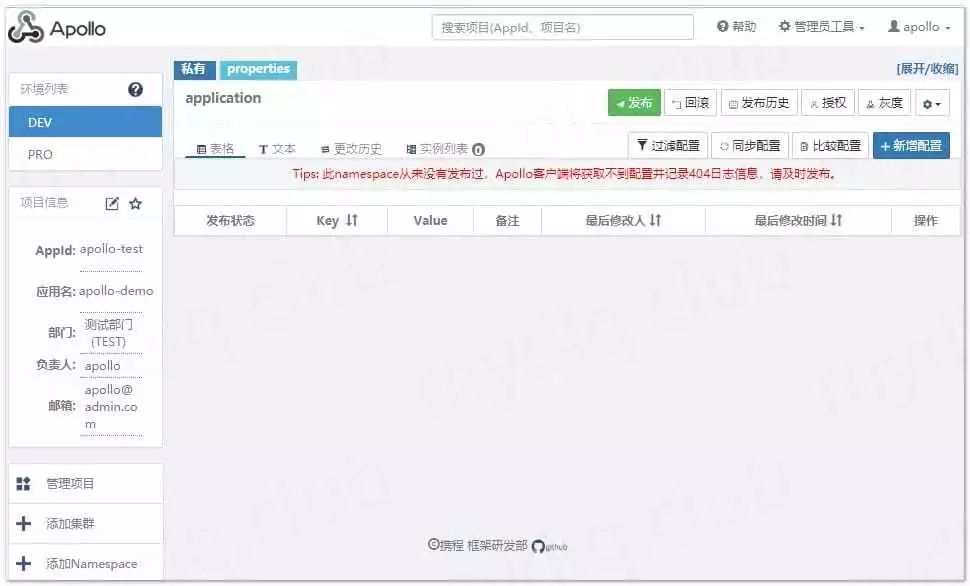

### 4、创建一个配置参数

创建一个配置参数，方便后续 Apollo 客户端项目引入该参数，进行动态配置测试。


设置 key 为 `test` value 为 `123456` 然后设置一个备注，保存。

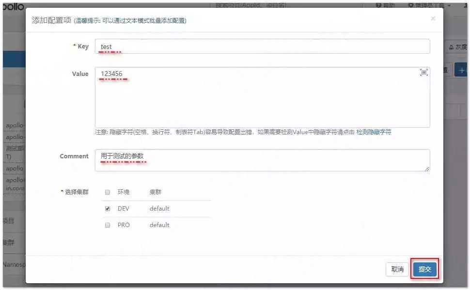

创建完成后可以看到配置管理节目新增了一条配置。


接下来我们将此配置通过发布按钮，进行发布。


三、创建 Apollo 客户端测试项目
-------------------

这里创建一个 SpringBoot 项目，引入 Apollo 客户端来来实现与 Apollo 配置中心服务端交互。

### 1、Maven 添加 Apollo 依赖

```
 1
 2\<project xmlns="http://maven.apache.org/POM/4.0.0" xmlns:xsi="http://www.w3.org/2001/XMLSchema-instance"
 3 xsi:schemaLocation="http://maven.apache.org/POM/4.0.0 http://maven.apache.org/xsd/maven-4.0.0.xsd"\>
 4    \<modelVersion\>4.0.0modelVersion>
 5
 6    \<parent\>
 7        \<groupId\>org.springframework.bootgroupId>
 8        \<artifactId\>spring-boot-starter-parentartifactId>
 9        \<version\>2.1.8.RELEASEversion>
10    parent>
11
12    \<groupId\>club.mydlqgroupId>
13    \<artifactId\>apollo-demoartifactId>
14    \<version\>0.0.1version>
15    \<name\>apollo-demoname>
16    \<description\>Apollo Demodescription>
17
18    \<properties\>
19        \<java.version\>1.8java.version>
20    properties>
21
22    \<dependencies\>
23        \<dependency\>
24            \<groupId\>org.springframework.bootgroupId>
25            \<artifactId\>spring-boot-starter-webartifactId>
26        dependency>
27        \<dependency\>
28            \<groupId\>com.ctrip.framework.apollogroupId>
29            \<artifactId\>apollo-clientartifactId>
30            \<version\>1.4.0version>
31        dependency>
32    dependencies>
33
34    \<build\>
35        \<plugins\>
36            \<plugin\>
37                \<groupId\>org.springframework.bootgroupId>
38                \<artifactId\>spring-boot-maven-pluginartifactId>
39            plugin>
40        plugins>
41    build>
42
43project>

```

### 2、配置文件添加参数

在 application.yml 配置文件中添加下面参数，这里简单介绍下 Apollo 参数作用：

* **apollo.meta：** Apollo 配置中心地址。
* **apollo.cluster：** 指定使用某个集群下的配置。
* **apollo.bootstrap.enabled：** 是否开启 Apollo。
* **apollo.bootstrap.namespaces ：** 指定使用哪个 Namespace 的配置，默认 application。
* **apollo.cacheDir=/opt/data/some-cache-dir：** 为了防止配置中心无法连接等问题，Apollo 会自动将配置本地缓存一份。
* **apollo.autoUpdateInjectedSpringProperties：** Spring应用通常会使用 Placeholder 来注入配置，如${someKey:someDefaultValue}，冒号前面的是 key，冒号后面的是默认值。如果想关闭 placeholder 在运行时自动更新功能，可以设置为 false。
* **apollo.bootstrap.eagerLoad.enabled ：** 将 Apollo 加载提到初始化日志系统之前，如果设置为 false，那么将打印出 Apollo 的日志信息，但是由于打印 Apollo 日志信息需要日志先启动，启动后无法对日志配置进行修改，所以 Apollo 不能管理应用的日志配置，如果设置为 true，那么 Apollo 可以管理日志的配置，但是不能打印出 Apollo 的日志信息。

```
 1#应用配置
 2server:
 3  port: 8080
 4spring:
 5  application:
 6    name: apollo-demo
 7
 8#Apollo 配置
 9app:
10  id: apollo-test                            #应用ID
11apollo:
12  cacheDir: /opt/data/                       #配置本地配置缓存目录
13  cluster: default                           #指定使用哪个集群的配置
14  meta: http://192.168.2.11:30002            #DEV环境配置中心地址
15  autoUpdateInjectedSpringProperties: true   #是否开启 Spring 参数自动更新
16  bootstrap:                                
17    enabled: true                            #是否开启 Apollo
18    namespaces: application                  #设置 Namespace
19    eagerLoad:
20      enabled: false                         #将 Apollo 加载提到初始化日志系统之前

```

### 3、创建测试 Controller 类

写一个 Controller 类来输出 test 变量的值，使用了 `Spring` 的 `@Value` 注解，用于读取配置文件中的变量的值，这里来测试该值，项目启动后读取到的变量的值是设置在 application 配置文件中的默认值，还是远程 Apollo 中的值，如果是 Apollo 中配置的值，那么再测试在 Apollo 配置中心中改变该变量的值后，这里是否会产生变化。

```
 1import org.springframework.beans.factory.annotation.Value;
 2import org.springframework.web.bind.annotation.GetMapping;
 3import org.springframework.web.bind.annotation.RestController;
 4
 5@RestController
 6public class TestController {
 7
 8    @Value("${test:默认值}")
 9    private String test;
10
11    @GetMapping("/test")
12    public String test(){
13        return "test的值为:" + test;
14    }
15}

```

### 4、创建启动类

SpringBoot 项目启动类。

```
 1import org.springframework.boot.SpringApplication;
 2import org.springframework.boot.autoconfigure.SpringBootApplication;
 3
 4@SpringBootApplication
 5public class Application {
 6
 7    public static void main(String[] args) {
 8        SpringApplication.run(Application.class, args);
 9    }
10
11}

```

### 5、JVM 启动参数添加启动参数

由于本人的 Apollo 是部署在 Kubernetes 环境中的，JVM 参数中必须添加两个变量：

* **env：** 应用使用 Apollo 哪个环境，例如设置为 `DEV` 就是指定使用开发环境，如果设置为 `PRO` 就是制定使用生产环境。
* **apollo.configService：** 指定配置中心的地址，跳过 meta 的配置，在测试时指定 meta 地址无效果。如果 Apollo 是部署在 Kubernetes 中，则必须设置该参数为配置中心地址，如果 Apollo 不是在 Kubernetes 环境中，可以不设置此参数，只设置 meta 参数即可。一般情况下，configService 和 meta 值一致。

**如果是在 Idea 中启动，可以配置启动参数，加上：**

```
1-Dapollo.configService=http://192.168.2.11:30002 -Denv=DEV

```


**如果是 java 命令启动程序，需要 JVM 加上:**

```
1$ java -Dapollo.configService=http://192.168.2.11:30002 -Denv=DEV -jar apollo-demo.jar

```

> 注意：上面 env 指定的环境，要和 apollo.meta 指定 Config 地址的环境一致，例如 -Denv=DEV 即使用开发环境，那么 apollo.meta=http://xxx.xxx.xxx:8080 这个url 的 Config 也是开发环境下的配置中心服务，而不能是 PRO 或者其它环境下的配置中心。

四、启动项目进行测试
----------

### 1、测试是否能够获取 Apollo 中设置的值

启动上面的测试用例，然后输入地址 http://localhost:8080/test 查看：

```
1test的值为:123456

```

可以看到使用的是 Apollo 中配置的 `test` 参数的值 `123456`，而不是默认的值。

### 2、测试当 Apollo 中修改参数值后客户端是否能及时刷新

修改 Apollo 配置中心参数 `test` 值为 `666666` ，然后再次发布。


发布完成后再次输入地址 http://localhost:8080/test 查看：

```
1test的值为:666666

```

可以看到示例应用中的值已经改变为最新的值。

### 3、测试当 Apollo 执行配置回滚操作时客户端是否能及时改变


回滚完成后状态将变为未发布状态，则时候输入地址 http://localhost:8080/test 查看：

```
1test的值为:123456

```

可以看到已经回滚到之前的 `test` 配置的值了。

### 4、测试当不能访问 Apollo 时客户端的变化

这里我们将 JVM 参数中 Apollo 配置中心地址故意改错：

```
1-Dapollo.configService=http://192.168.2.100:30002 -Denv=DEV

```

然后输入地址 http://localhost:8080/test 可以看到值为：

```
1test的值为:123456

```

可以看到显示的值并不是我们定义的默认值，而还是 Apollo 配置中心配置的 `test` 参数的值。考虑到由于 Apollo 会在本地将配置缓存一份，出现上面原因，估计是缓存生效。当客户端不能连接到 Apollo 配置中心时候，默认使用本地缓存文件中的配置。

上面我们配置了本地缓存配置文件存放地址为 “/opt/data/” ，接下来进入缓存目录，找到对应的缓存配置文件，删除缓存配置文件后，重启应用，再次输入地址查看：

```
1test的值为:默认值

```

删除缓存配置文件后，可以看到输出的值为自己定义的默认值。

### 5、测试当 Apollo 中将参数删除后客户端的变化

这里我们进入 Apollo 配置中心，删除之前创建的 `test` 参数，然后发布。


然后再次打开地址 http://localhost:8080/test 查看：

```
1test的值为:默认值

```

可以看到显示的是应用程序中设置的默认值。

五、对 Apollo 的 Cluster、Namespace 进行探究
-----------------------------------

在 Apollo 中，配置可以根据不同的环境划分为 Dev（开发）、Prod（生产） 等环境，又能根据区域划分为不同的 Cluster（集群），还能根据配置参数作用功能的不同划分为不同的 Namespace（命名空间），这里探究下，如何使用上述能力。

### 1、不同环境下的配置

**（1）、Apollo 配置中心 PRO 环境添加参数**

打开 Apollo 配置中心，环境列表点击 PRO 环境，然后新增一条配置，和之前例子中参数保持一致，都为 `test` 参数，创建完成后发布。


然后修改上面的示例项目，将配置参数指定为 PRO 环境:

**（2）、示例项目修改 application.yml 配置文件**

把 `apollo.meta` 参数改成 RPO 的配置中心地址

```
1......
2
3apollo:
4  meta: http://192.168.2.11:30005            #RPO环境配置中心地址
5
6......

```

**（3）、示例项目修改 JVM 参数**

把 `apollo.configService` 参数改成 PRO 配置中心地址，`env` 参数的值改为 `PRO`。

```
1-Dapollo.configService=http://192.168.2.11:30005 -Denv=PRO

```

**（4）、启动示例项目观察结果**

启动示例项目，然后接着输入地址 http://localhost:8080/test 查看信息：

```
1test的值为:abcdefg

```

可以看到已经改成生成环境配置，所以在实际项目中，如果要更换环境，需要修改 JVM 参数 `env`（如果 Apollo 部署在 Kubernetes 环境中，还需要修改 `apollo.configService` 参数），和修改 application.yml 配置文件的参数 `apollo.meta` 值。

### 2、不同集群下的配置

**（1）、创建两个集群**

例如在开发过程中，经常要将应用部署到不同的机房，这里分别创建 `beijing`、`shanghai` 两个集群。

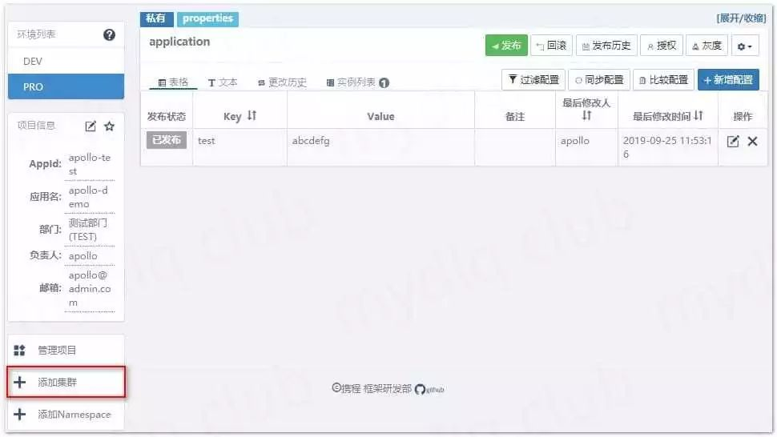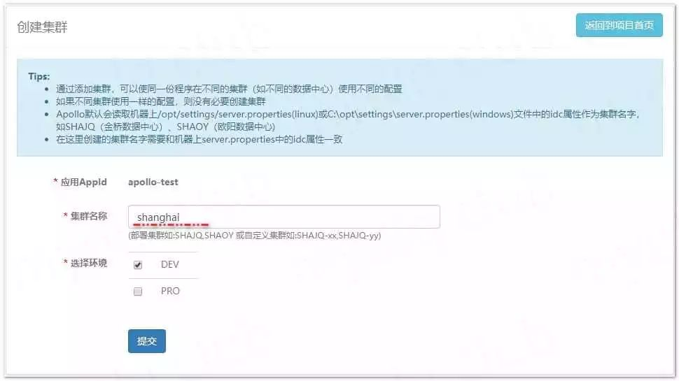

**（2）、两个集群都配置同样的参数不同的值**

在两个集群 `beijing` 与 `shanghai` 中，都统一配置参数 `test`，并且设置不同的值。


**（3）、示例项目 application.yml 修改集群配置参数,并启动项目观察结果**

**指定集群为 beijing:**

```
1......
2
3apollo:
4  cluster: beijing                      #指定使用 beijing 集群
5
6......

```

启动示例项目，然后接着输入地址 http://localhost:8080/test 查看信息：

```
1test的值为:Cluster-BeiJing

```

可以看到用的是 beijing 集群的配置

**指定集群为 shanghai:**

```
1......
2
3apollo:
4  cluster: shanghai                      #指定使用 shanghai 集群
5
6......

```

启动示例项目，然后接着输入地址 http://localhost:8080/test 查看信息：

```
1test的值为:Cluster-ShangHai

```

可以看到用的是 shanghai 集群的配置

### 3、不同命名空间下的配置

**（1）、创建两个命名空间**

命名空间有两种，一种是 public（公开），一种是 private 私有，公开命名空间所有项目都能读取配置信息，而私有的只能 `app.id` 值属于该应用的才能读取配置。

这里创建 `dev-1` 与 `dev-2` 两个私有的命名空间，用于测试。

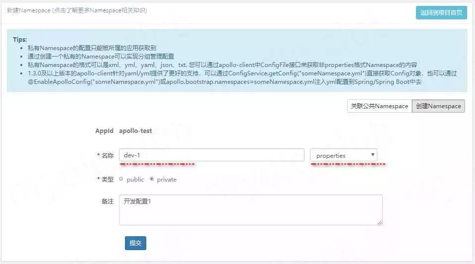

**（2）、两个集群都配置同样的参数不同的值**

在两个命名空间中，都统一配置参数 `test`，并且设置不同的值，设置完后发布。

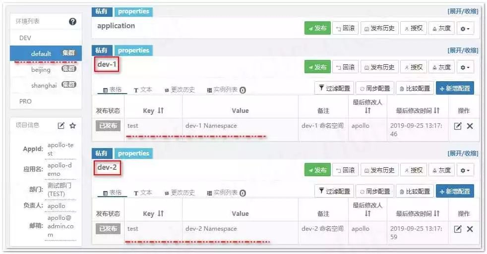

**（3）、示例项目 application.yml 修改命名空间配置参数,并启动项目观察结果**

**指定命名空间为 dev-1:**

```
1......
2
3apollo:
4  bootstrap:
5    namespaces: dev-1                   #设置 dev-1 命名空间
6
7......

```

启动示例项目，然后接着输入地址 http://localhost:8080/test 查看信息：

```
1test的值为:dev-1 Namespace

```

可以看到用的是 dev-1 命名空间的配置

**指定命名空间为 dev-2:**

```
1......
2
3apollo:
4  bootstrap:
5    namespaces: dev-2                   #设置 dev-1 命名空间
6
7......

```

启动示例项目，然后接着输入地址 http://localhost:8080/test 查看信息：

```
1test的值为:dev-2 Namespace

```

可以看到用的是 dev-2 命名空间的配置

六、Kubernetes 的 SpringBoot 应用使用 Apollo 配置中心
------------------------------------------

本人的 Apollo 和 SpringBoot 应用一般都是基于 Kubernetes 部署的，所以这里简单介绍下，如何在 Kubernetes 环境下部署 SpringBoot 应用且使用 Apollo 作为配置中心。

这里项目依旧使用上面的示例，不过首先要将其编译成 Docker 镜像，方便后续部署到 Kubernetes 环境下。

### 1、构建 Docker 镜像

**（1）、执行 Maven 编译**

首先执行 Maven 命令，将项目编译成一个可执行 JAR。

```
1$ mvn clean install

```

**（2）、准备 Dockerfile**

创建构建 Docker 镜像需要的 Dockerfile 文件，将 Maven 编译的 JAR 复制到镜像内部，然后设置两个变量，分别是：

* **JAVA\_OPTS：** Java JVM 启动参数变量，这里需要在这里加一个时区参数。
* **APP\_OPTS：** Spring 容器启动参数变量，方便后续操作时能通过此变量配置 Spring 参数。

Dockerfile：

```
1FROM openjdk:8u222-jre-slim
2VOLUME /tmp
3ADD target/*.jar app.jar
4RUN sh -c 'touch /app.jar'
5ENV JAVA_OPTS="-Duser.timezone=Asia/Shanghai"
6ENV APP_OPTS=""
7ENTRYPOINT [ "sh", "-c", "java $JAVA\_OPTS -Djava.security.egd=file:/dev/./urandom -jar /app.jar $APP\_OPTS" ]

```

**（3）、构建 Docker 镜像**

执行 Docker Build 命令构建 Docker 镜像。

```
1$ docker build -t mydlqclub/springboot-apollo:0.0.1 .

```

### 2、Kubernetes 部署示例应用

**（1）、创建 SpringBoot 且使用 Apollo 配置中心的 Kubernetes 部署文件**

这里创建 Kubernetes 下的 SpringBoot 部署文件 `apollo-demo-example.yaml`。在之前 Dockerfile 中设置了两个环境变量，`JAVA_OPTS` 与 `APP_OPTS`。其中 `JAVA_OPTS` 变量的值将会作为 JVM 启动参数，`APP_OPTS` 变量的值将会作为应用的配置参数。所以，这里我们将 Apollo 配置参数放置到变量中，这样一来就可以方便修改与维护 Apollo 的配置信息。

> 在下面配置的环境变量参数中，设置的配置中心地址为 `http://service-apollo-config-server-dev.mydlqclub:8080`，这是因为 Apollo 部署在 K8S 环境中，且可以使用域名方式访问，service-apollo-config-server-dev 是应用的 Service 名称，mydlqcloud 是 K8S 下的 Namespace 名称。

**springboot-apollo.yaml**

```
 1apiVersion: v1
 2kind: Service
 3metadata:
 4  name: springboot-apollo
 5spec:
 6  type: NodePort
 7  ports:
 8    - name: server
 9      nodePort: 31080
10      port: 8080
11      targetPort: 8080
12    - name: management
13      nodePort: 31081
14      port: 8081
15      targetPort: 8081
16  selector:
17    app: springboot-apollo
18---
19apiVersion: apps/v1
20kind: Deployment
21metadata:
22  name: springboot-apollo
23  labels:
24    app: springboot-apollo
25spec:
26  replicas: 1
27  selector:
28    matchLabels:
29      app: springboot-apollo
30  template:
31    metadata:
32      name: springboot-apollo
33      labels:
34        app: springboot-apollo
35    spec:
36      restartPolicy: Always
37      containers:
38        - name: springboot-apollo
39          image: mydlqclub/springboot-apollo:0.0.1
40          imagePullPolicy: Always
41          ports:
42            - containerPort: 8080
43              name: server
44          env:
45            - name: JAVA_OPTS
46              value: "-Denv=DEV"
47              ##注意修改此处的 mydlqcloud 为你自己的 Namespace 名称
48            - name: APP_OPTS
49              value: "
50                     --app.id=apollo-demo
51                     --apollo.bootstrap.enabled=true
52                     --apollo.bootstrap.eagerLoad.enabled=false
53                     --apollo.cacheDir=/opt/data/
54                     --apollo.cluster=default
55                     --apollo.bootstrap.namespaces=application
56                     --apollo.autoUpdateInjectedSpringProperties=true
57                     --apollo.meta=http://service-apollo-config-server-dev.mydlqcloud:8080    
58                     "
59          resources:
60            limits:
61              memory: 1000Mi
62              cpu: 1000m
63            requests:
64              memory: 500Mi
65              cpu: 500m

```

**（2）、部署 SpringBoot 应用到 Kubernetes**

-n：创建应用到指定的 Namespace 中。

```
1$ kubectl apply -f springboot-apollo.yaml -n mydlqcloud

```

### 3、测试部署的应用接口

上面的应用配置了 NodePort 端口，可以通过此端口访问 Kubernetes 集群内的应用接口，本人 Kubernetes 集群地址为 192.168.2.11 且 NodePort 端口为 31081，所以浏览器访问地址 http://192.168.2.11:31081/test 来测试接口，显示：

```
1test的值为:123456

```

可以看到能通过 Apollo 获取参数值，此文章到此结束。