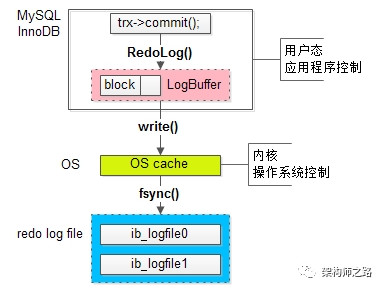

有个星球水友提问：

沈老师，我们有一次MySQL崩溃，重启后发现有些已经提交的事务对数据的修改丢失了，不是说事务能保证ACID特性么，想问下什么情况下可能导致“事务已经提交，数据却丢失”呢？

这个问题有点复杂，且容我系统性梳理下思路，先从**redo log**说起吧。

画外音：水友问的是MySQL，支持事务的是InnoDB，本文以InnoDB为例展开叙述，其他数据库不是很了解，但估计原理是相同的。

**为什么要有****redo log****？**

事务提交后，必须将事务对数据页的修改刷(fsync)到磁盘上，才能保证事务的ACID特性。

这个刷盘，是一个随机写，随机写性能较低，如果每次事务提交都刷盘，会极大影响数据库的性能。

**随机写性能差，有什么优化方法呢？**

架构设计中有两个常见的优化方法：

（1）先写日志(write log first)，将随机写**优化为**顺序写；

（2）将每次写**优化为**批量写；

这两个优化，数据库都用上了。

先说第一个优化，将对数据的修改先顺序写到日志里，这个日志就是redo log。

假如某一时刻，数据库崩溃，还没来得及将数据页刷盘，数据库重启时，会重做redo log里的内容，以保证已提交事务对数据的影响被刷到磁盘上。

一句话，redo log是为了保证已提交事务的ACID特性，同时能够提高数据库性能的技术。

既然redo log能保证事务的ACID特性，那为什么还会出现，水友提问中出现的“数据库奔溃，丢数据”的问题呢？一起看下redo log的实现细节。

**redo log****的三层架构？**

花了一个丑图，简单说明下redo log的三层架构：

* **粉色**，是InnoDB的一项很重要的内存结构(In-Memory Structure)，日志缓冲区(Log Buffer)，这一层，是MySQL应用程序用户态
* **屎黄色**，是操作系统的缓冲区(OS cache)，这一层，是OS内核态
* **蓝色**，是落盘的日志文件

**redo log****最终落盘的步骤如何？**

**首先**，事务提交的时候，会写入Log Buffer，这里调用的是MySQL自己的函数WriteRedoLog；

**接着**，只有当MySQL发起系统调用写文件write时，Log Buffer里的数据，才会写到OS cache。注意，MySQL系统调用完write之后，就认为文件已经写完，如果不flush，什么时候落盘，是操作系统决定的；

画外音：有时候打日志，明明printf了，tail -f却看不到，就是这个原因，这个细节在《[明明打印到文件了，为啥tail -f看不到](http://mp.weixin.qq.com/s?__biz=MjM5ODYxMDA5OQ==&mid=2651961118&idx=1&sn=86e672b96f24805176b04b29958299a2&chksm=bd2d02c28a5a8bd42ace9628a2359c277d589d34de1d92055b0c5676c9d6f6067c58d095e5e4&scene=21#wechat_redirect)》一文里说过，此处不再展开。

**最后**，由操作系统（当然，MySQL也可以主动flush）将OS cache里的数据，最终fsync到磁盘上；

**操作系统为什么要缓冲数据到****OS cache****里，而不直接刷盘呢？**

这里就是将“每次写”优化为“批量写”，以提高操作系统性能。

**数据库为什么要缓冲数据到****Log Buffer****里，而不是直接****write****呢？**

这也是“每次写”优化为“批量写”思路的体现，以提高数据库性能。

画外音：这个优化思路，非常常见，高并发的MQ落盘，高并发的业务数据落盘，都可以使用。

redo log的三层架构，MySQL做了一次批量写优化，OS做了一次批量写优化，确实能极大提升性能，**但有什么副作用吗？**

画外音：有优点，必有缺点。

这个**副作用**，就是可能丢失数据：

（1）事务提交时，将redo log写入Log Buffer，就会认为事务提交成功；

（2）如果写入Log Buffer的数据，write入OS cache之前，数据库崩溃，就会出现数据丢失；

（3）如果写入OS cache的数据，fsync入磁盘之前，操作系统奔溃，也可能出现数据丢失；

画外音：如上文所说，应用程序系统调用完write之后（不可能每次write后都立刻flush，这样写日志很蠢），就认为写成功了，操作系统何时fsync，应用程序并不知道，如果操作系统崩溃，数据可能丢失。

任何脱离业务的技术方案都是耍流氓：

（1）有些业务允许低效，但不允许一丁点数据丢失；

（2）有些业务必须高性能高吞吐，能够容忍少量数据丢失；

**MySQL是如何折衷的呢？**

MySQL有一个参数：

innodb\_flush\_log\_at\_trx\_commit

能够控制事务提交时，刷redo log的策略。

目前有**三种策略**：

**策略一：最佳性能**(innodb\_flush\_log\_at\_trx\_commit=0)

每隔一秒，才将Log Buffer中的数据批量write入OS cache，同时MySQL主动fsync。

这种策略，如果数据库奔溃，有一秒的数据丢失。

**策略二：强一致**(innodb\_flush\_log\_at\_trx\_commit=1)

每次事务提交，都将Log Buffer中的数据write入OS cache，同时MySQL主动fsync。

这种策略，是InnoDB的默认配置，为的是保证事务ACID特性。

**策略三：折衷**(innodb\_flush\_log\_at\_trx\_commit=2)

每次事务提交，都将Log Buffer中的数据write入OS cache；

每隔一秒，MySQL主动将OS cache中的数据批量fsync。

画外音：磁盘IO次数不确定，因为操作系统的fsync频率并不是MySQL能控制的。

这种策略，如果操作系统奔溃，最多有一秒的数据丢失。

画外音：因为OS也会fsync，MySQL主动fsync的周期是一秒，所以最多丢一秒数据。

讲了这么多，回到水友的提问上来，数据库崩溃，重启后丢失了数据，有很大的可能，是将innodb\_flush\_log\_at\_trx\_commit参数设置为0了，这位水友最好和DBA一起检查一下InnoDB的配置。

可能有水友要问，**高并发的业务，InnoDB运用哪种刷盘策略最合适？**

高并发业务，行业最佳实践，是使用**第三种折衷配置**（=2），这是因为：

（1）配置为2和配置为0，性能差异并不大，因为将数据从Log Buffer拷贝到OS cache，虽然跨越用户态与内核态，但毕竟只是内存的数据拷贝，速度很快；

（2）配置为2和配置为0，安全性差异巨大，操作系统崩溃的概率相比MySQL应用程序崩溃的概率，小很多，设置为2，只要操作系统不奔溃，也绝对不会丢数据。

**总结**
一、为了保证事务的ACID特性，理论上每次事务提交都应该刷盘，但此时效率很低，有两种优化方向：
（1）随机写优化为顺序写；
（2）每次写优化为批量写；

二、redo log是一种顺序写，它有三层架构：
（1）MySQL应用层：Log Buffer
（2）OS内核层：OS cache
（3）OS文件：log file

三、为了满足不用业务对于吞吐量与一致性的需求，MySQL事务提交时刷redo log有三种策略：
（1）0：每秒write一次OS cache，同时fsync刷磁盘，性能好；
（2）1：每次都write入OS cache，同时fsync刷磁盘，一致性好；
（3）2：每次都write入OS cache，每秒fsync刷磁盘，折衷；

四、高并发业务，行业内的最佳实践，是：
innodb\_flush\_log\_at\_trx\_commit=2