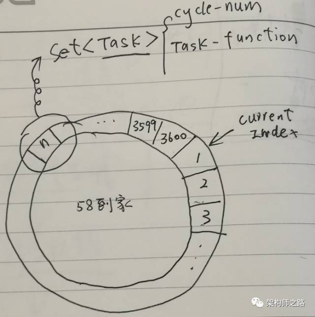

快狗打车订单完成后，如果用户一直不评价，48小时后会将自动评价为5星。

**怎么实现这类“48小时后自动评价为5星”需求呢？**

画外音：这类“一段时间之后，完成一个任务”的需求很常见。

**cron是不是最容易想到的方案？**

启动一个cron定时任务，每小时跑一次，将完成时间超过48小时，且仍未评价的订单取出，置为5星，并把评价状态置为已评价。

假设订单表的结构为：

order(oid, finish\_time, stars, status, …)

更具体的，定时任务每隔一个小时会这么做一次：

select oid from order where finish\_time \> 48 and status=0;

update order set stars=5 and status=1 where oid in[…];

如果数据量很大，需要分页查询，分页update，这将会是一个for循环。

**cron方案有什么不足？**

（1）轮询效率比较低；

（2）每次扫库，已经被执行过记录，仍然会被扫描（只是不会出现在结果集中），有重复计算的嫌疑；

（3）时效性不够好，如果每小时轮询一次，最差的情况下，时间误差会达到1小时；

（4）如果通过增加cron轮询频率来减少时间误差，则轮询低效和重复计算的问题会进一步凸显；

**对于这类需要延时执行的任务，如何保证效率的同时，又保证实时性呢？**

**答案是：高效延时消息。**

**
**

高效延时消息，包含**两个重要的数据结构**：

（1）环形队列，例如可以创建一个包含3600个slot的环形队列（本质是个数组）；

（2）任务集合，环上每一个slot是一个**Set\<Task\>**；

同时，**启动一个timer**：

（1）此timer每隔1s，在环形队列中移动一格；

（2）用一个Current Index来标识正在检测的slot；

**Task**结构中有**两个很重要的属性**：

（1）Cycle-Num：当Current Index第几圈扫描到这个Slot时，执行任务；

（2）Task-Function：需要执行的任务函数；

如上图，假设当前Current Index指向第一格，当有延时消息到达之后，例如希望3610秒之后，触发一个延时消息任务，只需：

（1）计算这个Task应该放在哪一个slot，现在指向1，3610秒之后，应该是第11格，所以这个Task应该放在第11个slot的Set\<Task\>中；

（2）计算这个Task的Cycle-Num，由于环形队列是3600格（每秒移动一格，正好1小时），这个任务是3610秒后执行，所以应该绕3610/3600=1圈之后再执行，于是Cycle-Num=1；

Current Index不停的移动，每秒移动一格，当移动到一个新slot，遍历这个slot中对应的Set\<Task\>，每个Task看Cycle-Num是不是0：

（1）如果不是0，说明还需要多移动几圈，将Cycle-Num减1；

（2）如果是0，说明马上要执行这个Task了，取出Task-Funciton执行，丢给工作线程执行，并把这个Task从Set\<Task\>中删除；

画外音：注意，不要用timer来执行任务，否则timer会越来越不准。

使用了“延时消息”方案之后，“订单48小时后关闭评价”的需求，只需将在订单关闭时，触发一个48小时之后的延时消息即可：

（1）无需再轮询全部订单，**效率高**；

（2）一个订单，**任务只执行一次**；

（3）**时效性好**，精确到秒；

画外音：控制timer移动频率可以控制精度。