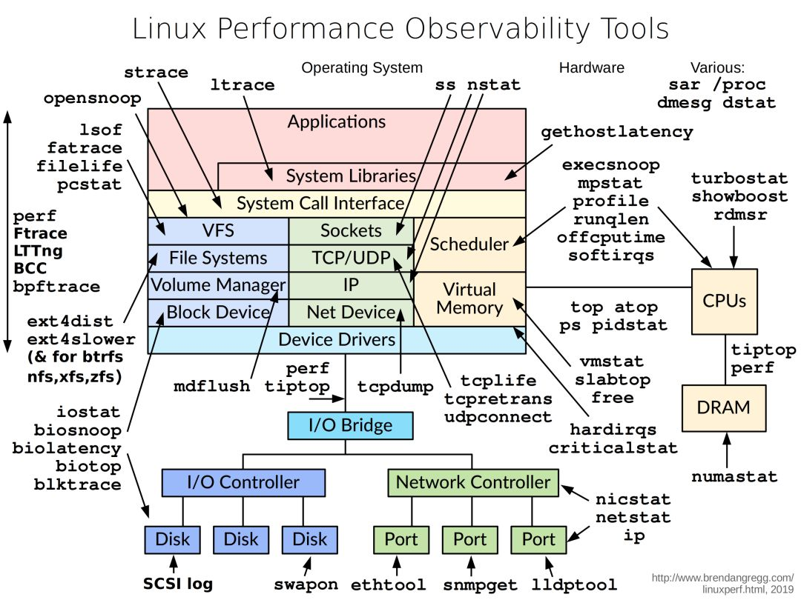

大家好，我是Z哥。

好久没写技术文章了，最近正好有进行一些思考，顺手写出来分享给大家。如果不是程序员的话，可以快速扫一眼正文的几个小标题，快速略过即可，毕竟思路和专业无关，很多是相通的。（如果愿意的话，顺手点个在看：D）

好了，正文开始。

上了一定规模的系统，特别是To C的系统，性能优化或多或少都会被逼着去做一下。否则，系统便无法支撑业务的发展，技术成了拖后腿，不是引领业务了。

一旦线上出现了性能问题，就会很棘手。因为它和业务功能上的Bug不同，后者的分析和解决思路更清晰，只要日志记录到位，沿着一条已知的业务逻辑线，很容易就能找到问题根源。

而性能问题就会复杂的多，导致的因素有很多，甚至会是多种因素共同作用下的结果。比如，代码质量低下、业务发展太快、架构设计不合理等等。

而且一般情况下，性能问题处理起来比较耗时，涉及到的分析链路可能会很长，特别是自己小组之外的上下游系统，很多人不愿意干，或者说有心无力。最多采用一些临时性的补救手段，碰碰运气。比如，扩容增加机器、重启大招、……。

有些临时性的补救措施，有时候不但不能解决问题，还会埋下新的隐患。

比如，从表象上看到某个程序因为给的资源不足导致产生性能问题。临时增加更多资源给它，可能从表面上看，问题是解决了。但是实则可能是因为程序内部对资源的使用上存在不合理的地方，增加资源只是延缓问题发作的时间，而且还可能会侵占其它程序的运行资源。

为了避免陷入如此的窘境，我们应当尽量提前进行性能优化，未雨绸缪。甚至最好是将它作为一个周期性的工作来进行。

接下去就来分享一下我对做性能优化的思路。

**/01 明确优化目的/**

很多人优化优化着慢慢变成了为了优化而优化，目的丢了，或者甚至一开始就没考虑过。如此会陷入到无意义的性能黑洞中，无法自拔，只是不断追求更好看的性能指标。

优化的目的可以是增强用户体验，比如消除一些有明显卡顿的页面和操作。还可以是节省服务器带宽流量、减少服务器压力这些。无论如何，你需要有一个目的。

**/02 定标准，做到什么程度/**

优化这事是永无止境的，为了避免陷入到前面说的无意义的性能黑洞中，我们最好能够根据实际的业务情况定义出一个相对客观的标准，代表优化到什么程度。

我自己惯用的标准是确保比预期高50%，如果条件允许则争取到100%。

比如，根据当下的性能指标与业务量对比，发现最大并发数可能会超过当前的2倍，那么此时优化到争取优化提升3倍，至少保证能提升2.5倍，是一个比较合理的标准。

**/03 找到瓶颈点/**

很多人做优化的时候，逮着代码就开始改。的确，只要有一定的知识积累，很容易就能从代码中发现，写法A不如写法B这样的代码。

但其实大部分情况下，「**流程上的优化远胜于语法级别的优化**」。比如将每一个字符串拼接改成用StringBuilder来实现，大多数情况下带来的成果其实很小，甚至在某些情况下还不如不改。

所以，我们最好还是能够借助一些客观数据，以获得更多的运行环境相关的信息，来找到整个“木桶”上最短的一块“板”。如整个系统的总体架构、服务器的信息等，便于定位到底性能的瓶颈点在哪。

「流程上的优化远胜于语法级别的优化」中的“流程”除了业务流程之外，还包括技术层面的流程，比如数据在网络中的流转过程。

**/04 着手优化/**

最后才是着手优化。

做优化的时候需要避免两个常见的误区。

第一，**不要过度追求应用的单机性能**，如果单机表现良好，还应该从整体的角度去思考。

第二，**不要过度追求单一维度上的极致优化**，比如过度追求 CPU 的性能而忽略了内存方面的瓶颈。

正确的思路一般符合下面两个方向。

第一，**空间换性能**。一个节点顶不住就多复制一个节点出来，独一份的数据导致资源竞争得厉害，就多复制一份数据出来。

第二，**距离换性能**。数据从服务端经过层层处理返回到客户端觉得慢的话，那么能不能直接保存在客户端，或者至少是离客户端尽可能近的地方。

好了，思路清楚了，具体在做的时候我建议你根据下面小标题的顺序进行。不管是主动地性能优化，还是被动地排查性能问题都一样。

**/01 应用程序层面/**

不管你愿不愿意承认，现实中的大部分性能问题皆是应用程序自身部分的代码导致的。

我们总是不太愿意承认自己的错误，我见过太多程序员总是习惯性的将问题先归结于硬件问题，网络问题等等，然后最终排查下来的根源往往还是在coding的应用程序上。

所以，我们更应该先从应用程序本身入手进行分析。而且，**应用程序所处的位置更「上游」，可操作性更强，让我们可以有更多的手段进行优化。**

**01 缓存**

首先，最常见的便是「缓存」，这是用空间换性能的经典。

数据必然是存储在非易失性的数据库中的，但是一些会被高频访问的数据，将它从数据库中复制一份，存储在易失性的内存上做缓存，可以大大提高被访问的性能。这个道理大家都懂，就不多说了。

但是值得提醒的一点是，缓存数据的数据结构设计很重要，没有一种数据结构是万能的。需要更多的权衡，因为数据结构设计的越简单、单一，缓存数据的二次运算就越多；反之，所有都存储「结果数据」的话，需要冗余的数据量又过大（缓存数据更新还麻烦）。

还得提醒一点，如果缓存的数据量不小，还得考虑增加一个缓存淘汰算法，否则缓存命中率不堪入目，白白浪费大量内存资源。

**02 异步**

举个现实生活中的例子，如果你在手机上点了一杯奶茶，去店里拿的时候发现前面还有20个号，你会在这干等半小时么？

我想大部分人都不会吧，宁愿去别的地方溜溜。异步就是通过避免“干等着”来提升性能的手段。

做异步主要是以下两种方式，

* 通过线程进行异步。这主要用于涉及到I/O的地方，像磁盘I/O和网络I/O。一旦产生I/O其实就意味着背后的操作是由另外一个程序在进行，此时CPU就不用空着了，让它忙别的去吧。
* 通过中间件异步，比如MQ。这用于更大的场景里，比如在某些流程中、上下游系统的衔接中，如果有些结果并不需要实时收到，那么通过MQ进行异步就可以大大提高性能。毕竟MQ的性能更接近NoSQL，性能自然比关系型数据库高的多。更何况，还将一些业务逻辑的预算给滞后了，当下的性能会更好。

**03 多线程&分布式**

这两点都是「分治」思想的体现。一个快递员送1000个包裹比较慢，那么让10个快递员同时各送100个自然就快了。

但是切勿分的太狠，毕竟，多起一个线程相当于多一个放养的娃，放出去太多的话，管理成本很高，可能反而会更慢。这就是线程切换的成本，分布式系统中也存在类似的管理成本。

不过，一个小建议送给你。**不到迫不得已，能通过「单机多线程」应付的，就不要引入分布式**了。因为，网络这个东西实在太不靠谱了，你得为它做大量的额外工作。

**04 延后运算**

这个和缓存的思路相反，将一些运算尽可能的延后到用的时候。适用的场景也和缓存相反，适用于一些低频的、运算耗时的数据上。

延迟加载、插件化等等就是该思想的体现。

**05 批量，合并**

如果你需要在短时间内频繁的传递多个数据给同一个目的地，那么尽量考虑将他们打包到一起，一次性传输，特别是涉及到I/O的场景。

如果手头的系统还是一个单点系统，这招的性价比就非常高。在避开分布式系统的复杂性的前提下，获得性能提升。

数据库的bulk操作，前端的sprite图，都是该思想的体现。

应用程序层面的其它优化方式还有很多。比如，用长链接代替频繁打开关闭的短链接、压缩、重用等等。这些相对比较简单和好理解，就不多说了。

应用程序层面的事情做到位了之后，我们再来考虑组件层面的优化。

**/02 组件层面/**

组件是指那些非业务性的东西，比如一些中间件、数据库、运行时的环境（JVM、WebServer）等。

数据库的调优，总的来说分为以下三部分：

* SQL语句。
* 索引。
* 连接池。

其它的一些，比如JVM的调优最主要的就是对「GC」相关的配置调优。WebServer的调优主要是针对「连接」相关的调优。这些细节就不赘述了，资料多到看不过来。

**/03 系统层面/**

系统层面的一些调优工作，涉及到运维工程师的一些工作，我不是很擅长就不误人子弟了。但是我们可以借助系统层面的一些技术指标来观测并判断我们的程序是否正常。比如，CPU、线程、网络、磁盘、内存。

**01 CPU**

判断CPU是否正常，大多数情况下关注这三个指标就够了，CPU利用率、CPU平均负载、CPU上下文切换。CPU利用率大家基本上都知道，就不多说了，那就说说后面两个。

关注CPU平均负载的时候，特别需要注意趋势的变化。如果 1 分钟/5 分钟/15 分钟的三个值相差不大，那说明系统负载很平稳，则不用关注，如果这三个值逐渐降低，说明负载在渐渐升高，需要排查具体的原因。

CPU上下文切换。上下文切换的次数越多，就意味着更多的CPU时间消耗在寄存器、内核栈以及虚拟内存等数据的保存和恢复上，真正进行你所期望的运算工作的时间就越少，系统的整体性能自然就会下降。导致这个情况的原因主要有两点，

程序内的磁盘I/O、网络I/O比较多。

程序内启动的线程过多。

**02 线程**

线程方面除了关注线程数之外，还需要关注一下处于「挂起」状态的线程数量有多少。

挂起状态的线程数过多，意味着程序里锁竞争激烈，需要考虑通过其它的方案来缩小锁的粒度、级别，甚至是避免用锁。

**03 网络**

通常在硬件层面内网带宽会远大于外网的带宽，所以，外网带宽被吃满的情况更加常见，特别是多图、多流媒体类型的可对外访问系统。关于流量大小相关的问题一般大家都能想到，就不多说了。

但是，Z哥提醒你要特别关注端口的使用和每个端口上的连接状态情况。比较常见的问题是，连接用完有没有及时释放，导致端口被占满，后续新的网络请求无法建立连接通道。（可以通过netstat、ss获取网络相关的信息。）

**04 磁盘**

除非是规模非常大的系统，否则一般情况下，从磁盘的指标上看不出啥问题。

平时看的时候，除了看看利用率、吞吐量和请求数量之外，有两个容易被忽略的点可以多关注下。

第一点，如果I/O利用率很高，但是吞吐量很小，则意味着存在较多的磁盘随机读写，最好把随机读写优化成顺序读写。（可以通过 strace 或者 blktrace 观察 I/O 是否连续判断是否是顺序的读写行为）

其次，如果I/O等待队列的长度比较大，则该磁盘存在 I/O 性能问题。一般来说，如果队列长度持续超过2就可以这么认为。

**05 内存**

关注内存的时候除了内存消耗之外，有一个Swap换入和换出的内存大小需要特别注意一下。因为Swap需要读写磁盘，所以性能不是很高。如果GC的时候遍历到的对象恰巧被Swap 出去了，便会有磁盘I/O产生，性能自然会下降。所以这个指标不应该太高。

大多数内存问题，都和对象常驻内存不及时释放有关，有很多工具可以观察对象的内存分配情况。如，jmap、VisualVM、heap dump等。

如果你的程序部署在linux系统上的话，不得不错过Brendan Gregg的大神整理的精华。下面就引用一张图，给大家感受一下，具体可以去 http://www.brendangregg.com/linuxperf.html 自行查阅更多相关的内容。

▲图片来自于brendangregg.com

最后，虽然性能优化是一件大家都知道的好事，但是再好的事做起来都有成本。所以，如非必要，不要过早、过度进行性能优化哦。

**总结**

这篇呢，Z哥和你聊了一下非常让程序员们头疼的程序性能问题。想要避免受这个问题困扰的前提是事前做好性能优化工作。

做性能优化不能走一步算一步。事先需要做三件事**「明确优化目的」、「定标准」、「找到瓶颈点」。**

具体做优化的时候建议**从应用程序层面开始，再到组件层面，最后才是系统层面，**从上往下，层层深入。顺带分享了每个层面的常用一些方法和思路。

希望对你有所启发。

在一个大系统中，数据就像水，整个系统就像是一个漏斗，漏斗的每一层代表每个子程序。上层的子程序对性能的损耗越低，能流下去的水就越多，直到最后一层「数据库」处，也可以理解为是存储。

所以，赶紧行动起来，开启保卫数据库之战吧。