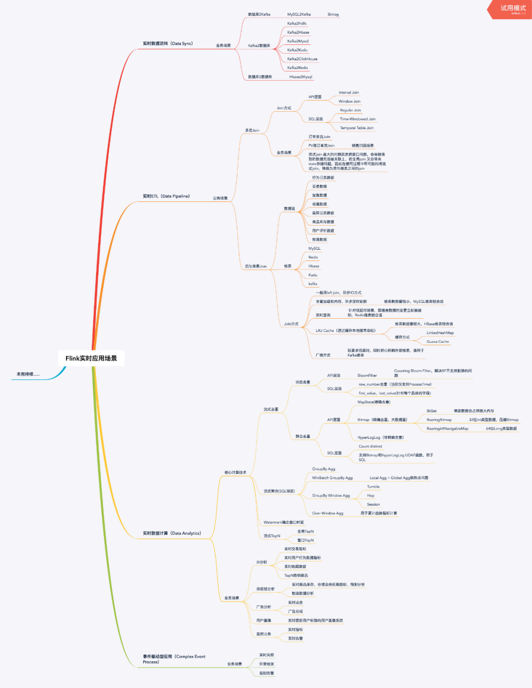
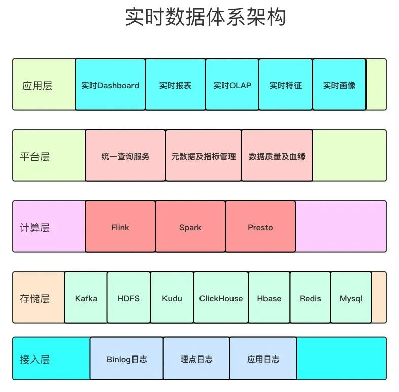
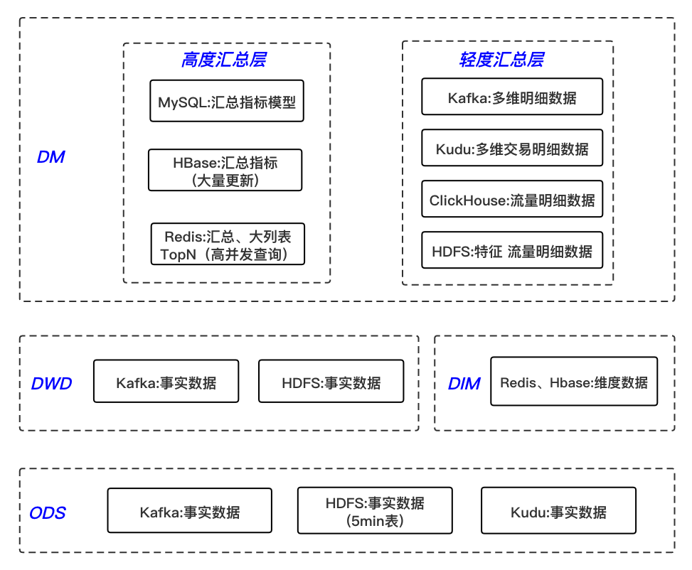

以下文章来源于Flink 中文社区 ，作者刘大龙@唯品会

[


Flink 中文社区

Apache Flink 官微，Flink PMC 维护

](https://mp.weixin.qq.com/s?__biz=MzIxMTE0ODU5NQ==&mid=2650239383&idx=1&sn=10933a52ddf0d7da1f8714076721c93a&chksm=8f5a1bcbb82d92dd6fac7130b8de1505d6333619f7f47fc85fda53825191a24f88b8ccc922b2&mpshare=1&scene=24&srcid=&sharer_sharetime=1588200175239&sharer_shareid=c160acc94f88b548659851d0c076f848&key=40ff362e82ee7cc508124f09efb0318a626cae9dc2eb0c0c292e55f0c6538667140a58417dd3fa3626472e61ffecf035fe0d6b476382de3d1bced26f712e25893f3b788dff3d2b92777aff13590120e9&ascene=0&uin=ODg4MTg5OTU%253D&devicetype=iMac+MacBookPro11%252C4+OSX+OSX+10.15.4+build(19E287)&version=12031d11&nettype=WIFI&lang=zh_CN&fontScale=100&exportkey=ASTaV8sehw1IUW4bf2suKl8%253D&pass_ticket=6Uk%252FL70PHmhyEfsGvmtGjHfRs1BoRzNc9lwVCUejU6U%253D#)

随着互联网的发展进入下半场，数据的时效性对企业的精细化运营越来越重要， 商场如战场，在每天产生的海量数据中，如何能实时有效的挖掘出有价值的信息， 对企业的决策运营策略调整有很大帮助。此外，随着 5G 技术的成熟、广泛应用， 对于工业互联网、物联网等数据时效性要求非常高的行业，企业就更需要一套完整成熟的实时数据体系来提高自身的行业竞争力。

本文从上述现状及实时数据需求出发，结合工业界案例、笔者的实时数据开发经验， 梳理总结了实时数据体系建设的总体方案，本文主要分为三个部分：

1. 第一部分主要介绍了当下在工业界比较火热的实时计算引擎 Flink 在实时数据体系建设过程中主要的应用场景及对应解决方案；
2. 第二部分从实时数据体系架构、实时数据模型分层、实时数据体系建设方式、流批一体实时数据架构发展等四个方面思考了实时数据体系的建设方案；
3. 第三部分则以一个具体案例介绍如何使用 Flink SQL 完成实时数据统计类需求。

**一、Flink 实时应用场景**

目前看来，Flink 在实时计算领域内的主要应用场景主要可分为四类场景， 分别是实时数据同步、流式 ETL、实时数据分析和复杂事件处理，具体的业务场景和对应的解决方案可详细研究下图， 文字层面不再详述。



**二、实时数据体系架构**

实时数据体系大致分为三类场景：流量类、业务类和特征类，这三种场景各有不同。

* 在数据模型上，流量类是扁平化的宽表，业务数仓更多是基于范式的建模，特征数据是 KV 存储；
* 从数据来源区分，流量数仓的数据来源一般是日志数据，业务数仓的数据来源是业务 binlog 数据，特征数仓的数据来源则多种多样;
* 从数据量而言，流量和特征数仓都是海量数据，每天十亿级以上，而业务数仓的数据量一般每天百万到千万级；
* 从数据更新频率而言，流量数据极少更新，则业务和特征数据更新较多，流量数据一般关注时序和趋势，业务数据和特征数据关注状态变更；
* 在数据准确性上，流量数据要求较低，而业务数据和特征数据要求较高。

**2.1 实时数据体系整体架构**



整个实时数据体系架构分为五层，分别是接入层，存储层，计算层、平台层和应用层，上图只是整体架构的概要图，每一层具体要做的事情，接下来通过文字来详述。

* **接入层**：该层利用各种数据接入工具收集各个系统的数据，包括 binlog 日志、埋点日志、以及后端服务日志，数据会被收集到 Kafka 中；这些数据不只是参与实时计算，也会参与离线计算，保证实时和离线的原始数据是统一的；
* **存储层**：该层对原始数据、清洗关联后的明细数据进行存储，基于统一的实时数据模型分层理念，将不同应用场景的数据分别存储在 Kafka、HDFS、Kudu、 Clickhouse、Hbase、Redis、Mysql 等存储引擎中，各种存储引擎存放的具体的数据类型在实时数据模型分层部分会详细介绍；
* **计算层**：计算层主要使用 Flink、Spark、Presto 以及 ClickHouse 自带的计算能力等四种计算引擎，Flink 计算引擎主要用于实时数据同步、 流式 ETL、关键系统秒级实时指标计算场景，Spark SQL 主要用于复杂多维分析的准实时指标计算需求场景，Presto 和 ClickHouse 主要满足多维自助分析、对查询响应时间要求不太高的场景；
* **平台层**：在平台层主要做三个方面的工作，分别是对外提供统一查询服务、元数据及指标管理、数据质量及血缘；
* **应用层**：以统一查询服务对各个业务线数据场景进行支持，业务主要包括实时大屏、实时数据产品、实时 OLAP、实时特征等。

其中，平台层详细工作如下：

1. 统一查询服务支持从底层明细数据到聚合层数据的查询，支持以SQL化方式查询Redis、Hbase等KV存储中的数据；
2. 元数据及指标管理：主要对实时的Kafka表、Kudu表、Clickhouse表、Hive表等进行统一管理，以数仓模型中表的命名方式规范表的命名，明确每张表的字段含义、使用方，指标管理则是尽量通过指标管理系统将所有的实时指标统一管理起来，明确计算口径，提供给不同的业务方使用；
3. 数据质量及血缘分析：数据质量分为平台监控和数据监控两个部分，血缘分析则主要是对实时数据依赖关系、实时任务的依赖关系进行分析。

平台监控部分一是对任务运行状态进行监控，对异常的任务进行报警并根据设定的参数对任务进行自动拉起与恢复，二是针对 Flink 任务要对 Kafka 消费处理延迟进行监控并实时报警。

数据据监控则分为两个部分，首先流式 ETL 是整个实时数据流转过程中重要的一环，ETL 的过程中会关联各种维表，实时关联时，定时对没有关联上的记录上报异常日志到监控平台，当数量达到一定阈值时触发报警， 其次，部分关键实时指标采用了 lambda 架构，因此需要对历史的实时指标与离线 hive 计算的数据定时做对比，提供实时数据的数据质量监控，对超过阈值的指标数据进行报警。

为了配合数据监控，需要做实时数据血缘，主要是梳理实时数据体系中数据依赖关系，以及实时任务的依赖关系，从底层ODS 到 DW 再到 DM，以及 DM 层被哪些模型用到， 将整个链条串联起来，这样做在数据/任务主动调整时可以通知关联的下游，指标异常时借助血缘定位问题，同时基于血缘关系的分析，我们也能评估数据的应用价值，核算数据的计算成本。

****

**2.2 实时数据模型分层**



离线数仓考虑到效率问题，一般会采取空间换时间的方式，层级划分会比较多；实时数仓考虑到实时性问题，分层则越少越好，另外也减少了中间流程出错的可能性，因此将其分为四层。

**
**

**■ ODS 层：**

操作数据层，保存原始数据，对非结构化的数据进行结构化处理，轻度清洗，几乎不删除原始数据；

该层的数据主要来自业务数据库的 binlog 日志、埋点日志和应用程序日志；

对于 binlog 日志通过 canal 监听，写到消息队列 Kafka 中，对应于埋点和应用程序日志，则通过 Filebeat 采集 nginx 和 tomcat 日志，上报到Kafka 中；

除了存储在 Kafka 中，同时也会对业务数据库的 binlog 日志通过 Flink 写入 HDFS、Kudu 等存储引擎，落地到 5min Hive 表，供查询明细数据，同时也提供给离线数仓，做为其原始数据；另外，对于埋点日志数据，由于 ODS 层是非结构化的，则没有必要落地。

**
**

****■ **DWD 层：**

实时明细数据层，以业务过程作为建模驱动，基于每个具体的业务过程特点，构建最细粒度的明细层事实表；可以结合企业的数据使用特点，将明细事实表的某些重要维度属性字段做适当冗余，也即宽表化处理；

该层的数据来源于 ODS 层，通过简单的 Streaming ETL 后得到，对于 binlog 日志的处理主要进行简单的数据清洗、处理数据漂移，以及可能对多个 ODS 层的表进行 Streaming Join，对流量日志主要是做一些通用ETL 处理，将非结构化的数据结构化，关联通用的维度字段；

该层的数据存储在消息队列 Kafka 中，同时也会用 Flink 实时写入 Hive 5min 表，供查询明细数据，同时要提供给离线数仓，做为其原始数据。

**
**

******■ ****DIM 层：**

* 公共维度层，基于维度建模理念思想，建立整个业务过程的一致性维度，降低数据计算口径和算法不统一风险；
* DIM 层数据来源于两部分：一部分是Flink程序实时处理ODS层数据得到，另外一部分是通过离线任务出仓得到；
* DIM 层维度数据主要使用 MySQL、Hbase、Redis 三种存储引擎，对于维表数据比较少的情况可以使用 MySQL，对于单条数据大小比较小，查询 QPS 比较高的情况，可以使用 Redis 存储，降低机器内存资源占用，对于数据量比较大，对维表数据变化不是特别敏感的场景，可以使用HBase 存储。

********■ ******DM 层：**

**（1）数据集市层**

以数据域+业务域的理念建设公共汇总层，对于DM层比较复杂，需要综合考虑对于数据落地的要求以及具体的查询引擎来选择不同的存储方式，分为轻度汇总层和高度汇总层，同时产出，高度汇总层数据用于前端比较简单的KV查询， 提升查询性能，比如实时大屏，实时报表等，数据的时效性要求为秒级，轻度汇总层Kafka中宽表实时写入OLAP存储引擎，用于前端产品复杂的OLAP查询场景，满足自助分析和产出复杂报表的需求，对数据的时效性要求可容忍到分钟级；

**（2）**轻度汇总层

**
**

* 轻度汇总层由明细层通过Streaming ETL得到，主要以宽表的形式存在，业务明细汇总是由业务事实明细表和维度表join得到，流量明细汇总是由流量日志按业务线拆分和维度表join得到；
* 轻度汇总层数据存储比较多样化，首先利用Flink实时消费DWD层Kafka中明细数据join业务过程需要的维表，实时打宽后写入该层的Kafka中，以Json或PB格式存储；
* 同时对多维业务明细汇总数据通过Flink实时写入Kudu，用于查询明细数据和更复杂的多维数据分析需求，对于流量数据通过Flink分别写入HDFS和ClickHouse用于复杂的多维数据分析， 实时特征数据则通过Flink join维表后实时写入HDFS，用于下游的离线ETL消费；
* 对于落地Kudu和HDFS的宽表数据，可用Spark SQL做分钟级的预计算，满足业务方复杂数据分析需求，提供分钟级延迟的数据，从而加速离线ETL过程的延迟， 另外随着Flink SQL与Hive生态集成的不断完善，可尝试用Flink SQL做离线ETL和OLAP计算任务(Flink流计算基于内存计算的特性，和presto非常类似，这使其也可以成为一个OLAP计算引擎)，用一套计算引擎解决实时离线需求，从而实现批流统一；
* 对于Kudu中的业务明细数据、ClickHouse中的流量明细数据，也可以满足业务方的个性化数据分析需求，利用强大的OLAP计算引擎，实时查询明细数据，在10s量级的响应时间内给出结果，这类需求也即是实时OLAP需求，灵活性比较高。

****（3）**高度汇总层**

* 高度汇总层由明细数据层或轻度汇总层通过聚合计算后写入到存储引擎中，产出一部分实时数据指标需求，灵活性比较差；
* 计算引擎使用Flink Datastream API和Flink SQL，指标存储引擎根据不同的需求，对于常见的简单指标汇总模型可直接放在MySQL里面，维度比较多的、写入更新比较大的模型会放在HBase里面， 还有一种是需要做排序、对查询QPS、响应时间要求非常高、且不需要持久化存储如大促活动期间在线TopN商品等直接存储在Redis里面；
* 在秒级指标需求中，需要混用Lambda和Kappa架构，大部分实时指标使用Kappa架构完成计算，少量关键指标（如金额相关）使用Lambda架构用批处理重新处理计算，增加一次校对过程。

总体来说 DM 层对外提供三种时效性的数据：

首先是 Flink 等实时计算引擎预计算好的秒级实时指标，这种需求对数据的时效性要求非常高，用于实时大屏、计算维度不复杂的实时报表需求。

其次是 Spark SQL 预计算的延迟在分钟级的准实时指标， 该类指标满足一些比较复杂但对数据时效性要求不太高的数据分析场景，可能会涉及到多个事实表的join，如销售归因等需求。

最后一种则是不需要预计算，ad-hoc查询的复杂多维数据分析场景，此类需求比较个性化，灵活性比较高，如果 OLAP 计算引擎性能足够强大，也可完全满足秒级计算需求的场景; 对外提供的秒级实时数据和另外两种准实时数据的比例大致为 3：7，绝大多数的业务需求都优先考虑准实时计算或 ad-hoc 方式，可以降低资源使用、提升数据准确性，以更灵活的方式满足复杂的业务场景。

**2.3 实时数据体系建设方式**

整个实时数据体系分为两种建设方式，即实时和准实时(它们的实现方式分别是基于流计算引擎和 ETL、OLAP 引擎，数据时效性则分别是秒级和分钟级。

* 在**调度开销**方面，准实时数据是批处理过程，因此仍然需要调度系统支持，调度频率较高，而实时数据却没有调度开销；
* 在**业务灵活性**方面，因为准实时数据是基于 ETL 或 OLAP 引擎实现，灵活性优于基于流计算的方式；
* 在对**数据晚到的容忍度**方面，因为准实时数据可以基于一个周期内的数据进行全量计算，因此对于数据晚到的容忍度也是比较高的，而实时数据使用的是增量计算，对于数据晚到的容忍度更低一些；
* 在**适用场景**方面，准实时数据主要用于有实时性要求但不太高、涉及多表关联和业务变更频繁的场景，如交易类型的实时分析，实时数据则更适用于实时性要求高、数据量大的场景，如实时特征、流量类型实时分析等场景。

**2.4 流批一体实时数据架构发展**

从1990年 Inmon 提出数据仓库概念到今天，大数据架构经历了从最初的离线大数据架构、Lambda 架构、Kappa 架构以及 Flink 的火热带出的流批一体架构，数据架构技术不断演进，本质是在往流批一体的方向发展，让用户能以最自然、最小的成本完成实时计算。

* **离线大数据架构**：数据源通过离线的方式导入到离线数仓中，下游应用根据业务需求选择直接读取 DM 或加一层数据服务，比如 MySQL 或 Redis，数据存储引擎是 HDFS/Hive，ETL 工具可以是 MapReduce 脚本或 HiveSQL。数据仓库从模型层面分为操作数据层 ODS、数据仓库明细层 DWD、数据集市层 DM；
* **Lambda 架构**：随着大数据应用的发展，人们逐渐对系统的实时性提出了要求，为了计算一些实时指标，就在原来离线数仓的基础上增加了一个实时计算的链路，并对数据源做流式改造（即把数据发送到消息队列），实时计算去订阅消息队列，直接完成指标增量的计算，推送到下游的数据服务中去，由数据服务层完成离线&实时结果的合并；
* **Kappa 架构**：Lambda 架构虽然满足了实时的需求，但带来了更多的开发与运维工作，其架构背景是流处理引擎还不完善，流处理的结果只作为临时的、近似的值提供参考。后来随着 Flink 等流处理引擎的出现，流处理技术成熟起来，这时为了解决两套代码的问题，LickedIn 的 Jay Kreps 提出了 Kappa 架构；
* **流批一体架构**：流批一体架构比较完美的实现方式是采用流计算 + 交互式分析双引擎架构，在这个架构中，流计算负责的是基础数据，而交互式分析引擎是中心，流计算引擎对数据进行实时 ETL 工作，与离线相比，降低了 ETL 过程的 latency，交互式分析引擎则自带存储，通过计算存储的协同优化， 实现高写入 TPS、高查询 QPS 和低查询 latency ，从而做到全链路的实时化和 SQL 化，这样就可以用批的方式实现实时分析和按需分析，并能快速的响应业务的变化，两者配合，实现 1 + 1 \> 2 的效果； 该架构对交互式分析引擎的要求非常高，也许是未来大数据库技术发展的一个重点和方向。

为了应对业务方更复杂的多维实时数据分析需求，笔者目前在数据开发中引入 Kudu这个 OLAP 存储引擎，对订单等业务数据使用 Presto + Kudu 的计算方案也是在探索流批一体架构在实时数据分析领域的可行性。此外，目前比较热的数据湖技术，如 Delta lake、Hudi 等支持在 HDFS 上进行 upsert 更新，随着其流式写入、SQL 引擎支持的成熟，未来可以用一套存储引擎解决实时、离线数据需求，从而减少多引擎运维开发成本。

**三、Flink SQL 实时计算 UV 指标**

上一部分从宏观层面介绍了如何建设实时数据体系，非常不接地气，可能大家需要的只是一个具体的 case 来了解一下该怎么做，那么接下来用一个接地气的案例来介绍如何实时计算 UV 数据。大家都知道，在 ToC 的互联网公司，UV 是一个很重要的指标，对于老板、商务、运营的及时决策会产生很大的影响，笔者在电商公司，目前主要的工作就是计算 UV、销售等各类实时数据，体验就特别深刻， 因此就用一个简单demo 演示如何用 Flink SQL 消费 Kafka 中的 PV 数据，实时计算出 UV 指标后写入 Hbase。

**3.1 Kafka 源数据解析**

PV 数据来源于埋点数据经 FileBeat 上报清洗后，以 ProtoBuffer 格式写入下游 Kafka，消费时第一步要先反序列化 PB 格式的数据为 Flink 能识别的 Row 类型，因此也就需要自定义实现 DeserializationSchema 接口，具体如下代码， 这里只抽取计算用到的 PV 的 mid、事件时间 time\_local，并从其解析得到 log\_date 字段：

    * 
    * 
    * 
    * 
    * 
    * 
    * 
    * 
    * 
    * 
    * 
    * 
    * 
    * 
    * 
    * 
    * 
    * 
    * 
    * 
    * 
    * 
    * 
    * 
    * 
    * 
    * 
    * 
    * 

    ```
    public class PageViewDeserializationSchema implements DeserializationSchema\<Row\> {
     public static final Logger LOG = LoggerFactory.getLogger(PageViewDeserializationSchema.class); protected SimpleDateFormat dayFormatter;
     private final RowTypeInfo rowTypeInfo;
     public PageViewDeserializationSchema(RowTypeInfo rowTypeInfo){ dayFormatter = new SimpleDateFormat("yyyyMMdd", Locale.UK); this.rowTypeInfo = rowTypeInfo; } @Override public Row deserialize(byte[] message) throws IOException { Row row = new Row(rowTypeInfo.getArity()); MobilePage mobilePage = null; try { mobilePage = MobilePage.parseFrom(message); String mid = mobilePage.getMid(); row.setField(0, mid); Long timeLocal = mobilePage.getTimeLocal(); String logDate = dayFormatter.format(timeLocal); row.setField(1, logDate); row.setField(2, timeLocal); }catch (Exception e){ String mobilePageError = (mobilePage != null) ? mobilePage.toString() : ""; LOG.error("error parse bytes payload is {}, pageview error is {}", message.toString(), mobilePageError, e); } return null; }
    ```

**3.2 编写 Flink Job 主程序**

将 PV 数据解析为 Flink 的 Row 类型后，接下来就很简单了，编写主函数，写 SQL 就能统计 UV 指标了，代码如下：

    * 
    * 
    * 
    * 
    * 
    * 
    * 
    * 
    * 
    * 
    * 
    * 
    * 
    * 
    * 
    * 
    * 
    * 
    * 
    * 
    * 
    * 
    * 
    * 
    * 
    * 
    * 
    * 
    * 
    * 
    * 
    * 
    * 
    * 
    * 
    * 
    * 
    * 
    * 
    * 
    * 
    * 
    * 
    * 
    * 
    * 
    * 
    * 
    * 
    * 
    * 
    * 
    * 
    * 
    * 
    * 
    * 
    * 
    * 
    * 
    * 
    * 
    * 
    * 
    * 
    * 
    * 
    * 
    * 
    * 
    * 
    * 
    * 
    * 
    * 
    * 
    * 
    * 
    * 
    * 
    * 
    * 
    * 
    * 
    * 
    * 
    * 
    * 
    * 

    ```
    public class RealtimeUV {
     public static void main(String[] args) throws Exception { //step1 从properties配置文件中解析出需要的Kakfa、Hbase配置信息、checkpoint参数信息 Map\<String, String\> config = PropertiesUtil.loadConfFromFile(args[0]); String topic = config.get("source.kafka.topic"); String groupId = config.get("source.group.id"); String sourceBootStrapServers = config.get("source.bootstrap.servers"); String hbaseTable = config.get("hbase.table.name"); String hbaseZkQuorum = config.get("hbase.zk.quorum"); String hbaseZkParent = config.get("hbase.zk.parent"); int checkPointPeriod = Integer.parseInt(config.get("checkpoint.period")); int checkPointTimeout = Integer.parseInt(config.get("checkpoint.timeout"));
     StreamExecutionEnvironment sEnv = StreamExecutionEnvironment.getExecutionEnvironment(); //step2 设置Checkpoint相关参数，用于Failover容错 sEnv.getConfig().registerTypeWithKryoSerializer(MobilePage.class, ProtobufSerializer.class); sEnv.getCheckpointConfig().setFailOnCheckpointingErrors(false); sEnv.getCheckpointConfig().setMaxConcurrentCheckpoints(1); sEnv.enableCheckpointing(checkPointPeriod, CheckpointingMode.EXACTLY\_ONCE); sEnv.getCheckpointConfig().setCheckpointTimeout(checkPointTimeout); sEnv.getCheckpointConfig().enableExternalizedCheckpoints( CheckpointConfig.ExternalizedCheckpointCleanup.RETAIN\_ON\_CANCELLATION);
     //step3 使用Blink planner、创建TableEnvironment,并且设置状态过期时间，避免Job OOM EnvironmentSettings environmentSettings = EnvironmentSettings.newInstance() .useBlinkPlanner() .inStreamingMode() .build(); StreamTableEnvironment tEnv = StreamTableEnvironment.create(sEnv, environmentSettings); tEnv.getConfig().setIdleStateRetentionTime(Time.days(1), Time.days(2));
     Properties sourceProperties = new Properties(); sourceProperties.setProperty("bootstrap.servers", sourceBootStrapServers); sourceProperties.setProperty("auto.commit.interval.ms", "3000"); sourceProperties.setProperty("group.id", groupId);
     //step4 初始化KafkaTableSource的Schema信息，笔者这里使用register TableSource的方式将源表注册到Flink中，而没有用register DataStream方式，也是因为想熟悉一下如何注册KafkaTableSource到Flink中 TableSchema schema = TableSchemaUtil.getAppPageViewTableSchema(); Optional\<String\> proctimeAttribute = Optional.empty(); List\<RowtimeAttributeDescriptor\> rowtimeAttributeDescriptors = Collections.emptyList(); Map\<String, String\> fieldMapping = new HashMap\<\>(); List\<String\> columnNames = new ArrayList\<\>(); RowTypeInfo rowTypeInfo = new RowTypeInfo(schema.getFieldTypes(), schema.getFieldNames()); columnNames.addAll(Arrays.asList(schema.getFieldNames())); columnNames.forEach(name -\> fieldMapping.put(name, name)); PageViewDeserializationSchema deserializationSchema = new PageViewDeserializationSchema( rowTypeInfo); Map\<KafkaTopicPartition, Long\> specificOffsets = new HashMap\<\>(); Kafka011TableSource kafkaTableSource = new Kafka011TableSource( schema, proctimeAttribute, rowtimeAttributeDescriptors, Optional.of(fieldMapping), topic, sourceProperties, deserializationSchema, StartupMode.EARLIEST, specificOffsets); tEnv.registerTableSource("pageview", kafkaTableSource);
     //step5 初始化Hbase TableSchema、写入参数，并将其注册到Flink中 HBaseTableSchema hBaseTableSchema = new HBaseTableSchema(); hBaseTableSchema.setRowKey("log\_date", String.class); hBaseTableSchema.addColumn("f", "UV", Long.class); HBaseOptions hBaseOptions = HBaseOptions.builder() .setTableName(hbaseTable) .setZkQuorum(hbaseZkQuorum) .setZkNodeParent(hbaseZkParent) .build(); HBaseWriteOptions hBaseWriteOptions = HBaseWriteOptions.builder() .setBufferFlushMaxRows(1000) .setBufferFlushIntervalMillis(1000) .build(); HBaseUpsertTableSink hBaseSink = new HBaseUpsertTableSink(hBaseTableSchema, hBaseOptions, hBaseWriteOptions); tEnv.registerTableSink("uv\_index", hBaseSink);
     //step6 实时计算当天UV指标sql, 这里使用最简单的group by agg，没有使用minibatch或窗口，在大数据量优化时最好使用后两种方式 String uvQuery = "insert into uv\_index " + "select log\_date,\\n" + "ROW(count(distinct mid) as UV)\\n" + "from pageview\\n" + "group by log\_date"; tEnv.sqlUpdate(uvQuery); //step7 执行Job sEnv.execute("UV Job"); }}
    ```

以上就是一个简单的使用 Flink SQL 统计 UV 的 case, 代码非常简单，只需要理清楚如何解析 Kafka 中数据，如何初始化 Table Schema，以及如何将表注册到 Flink中，即可使用 Flink SQL 完成各种复杂的实时数据统计类的业务需求，学习成本比API 的方式低很多。说明一下，笔者这个 demo 是基于目前业务场景而开发的，在生产环境中可以真实运行起来，可能不能拆箱即用，你需要结合自己的业务场景自定义相应的 kafka 数据解析类。