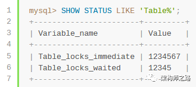
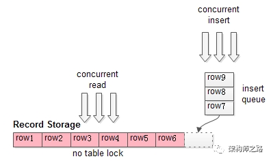
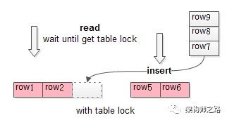
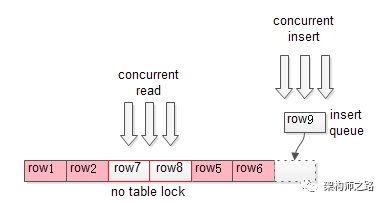

继续回答星球水友提问：

沈老师，MyISAM只支持表锁，但网上文章却说，在并发插入量比较大的时候，比较适合使用MyISAM，这矛盾吗？

这个问题，涉及MySQL表锁的一些细节，借着这个问题，系统性说下表锁的“所以然”。

画外音：网上不少文章只说结论，不说为什么，容易让人蒙圈。

MySQL表锁知识系统性梳理。

**哪些存储引擎使用表锁？**

MySQL，除InnoDB支持行锁外，MySQL的其他存储引擎均只使用表锁，例如：MyISAM, MEMORY, MERGE等。

**表锁有什么好处？**

（1）表锁占用内存少很多，行锁的数量与行记录数相关，非常耗内存；

（2）如果业务经常读写表中很大一部分数据时，表锁会更快，因为此时只涉及一个锁，而不是同时管理N多个锁；

（3）如果业务经常使用group by，表锁会更快，原因同（2）；

画外音：这样的一些场景，使用MyISAM比InnoDB更优。

**表锁是怎么运作的？**

和其他临界资源的读写锁类似。

**写时**，要加**写锁**：

（1）如果表没有锁，对表加写锁；

（2）否则，入写锁队列；

**读时**，要加**读锁**：

（1）如果表没有写锁，对表加读锁；

（2）否则，入读锁队列；

**表锁释放时**：

如果写锁队列和读锁队列里都有锁，写有更高的优先级，即写锁队列先出列。这么做的原因是，如果有“大查询”，可能会导致写锁被批量“饿死”，而写锁往往释放很快。

画外音：潜台词是，如果有大量并发update请求，select会等所有update请求执行完才执行。

**如何查看表锁情况？**

如果要分析表锁冲突情况，可查看：

**Table\_locks\_immediate**：立刻获得表锁的次数；

**Table\_locks\_waited**：需要等待表锁的次数；

这两个变量。

使用以下命令查看：

show status like 'Table%';

如果等待表锁的次数占比较大，说明表锁可能是潜在瓶颈。

说了半天，还是没有讲到点子上，**为什么在并发插入量比较大的时候，比较适合使用MyISAM呢？****不会因为表锁频繁冲突而导致吞吐量降低吗？**

画外音：知识的系统性，比问题答案更重要。

**知识点一：**

MyISAM的索引与记录存储分离，有单独的区域存储行记录，PK是非聚集索引。

这个知识点就不展开了，《[数据库，主键为何不宜太长？](http://mp.weixin.qq.com/s?__biz=MjM5ODYxMDA5OQ==&mid=2651962826&idx=1&sn=dcfbf4e0aad03dbaabe2cbb6b790f476&chksm=bd2d08168a5a810038163bfa6486d324051f5fff31df702579fed41b68fb99762ea383e00fcb&scene=21#wechat_redirect)》刚讲过。

**知识点二：**

MyISAM表，如果数据文件(data file)紧密存储，中间没有空闲块(free blocks)，数据总是插入到数据文件的尾部(end)，就如同追加日志一样，性能很高，此时的并发insert与select是不加锁的(lock free)。

如上图所示：

（1）数据文件连续且紧密的存储着；

（2）并发insert无表锁争抢（只需插入队列互斥）；

（3）insert只在数据文件的尾部进行；

（4）并发select也能够同时进行（共享读锁）；

**知识点三：**

MyISAM表，如果数据文件(data file)中间有空洞(hole)，上述机制会失效，直到空洞被新数据填满，又会启用不加锁机制。

**空洞是怎么导致的？**

删除或者修改数据，都可能导致空洞。

如上图所示：

（1）中间删除了一些数据，导致中间出现空闲块(free blocks)；

（2）此时，select和insert会有表锁冲突，无法并发；

再如上图所示：

（1）随着插入的进行，中间的空闲块又被填满了；

（2）此时，并发select和insert又恢复了；

**结论**

虽然MyISAM只支持表锁，但高并发select与insert的业务场景，上述机制使得MyISAM的**表锁**依然有非常强劲的性能。

画外音：本文基于MySQL5.6。